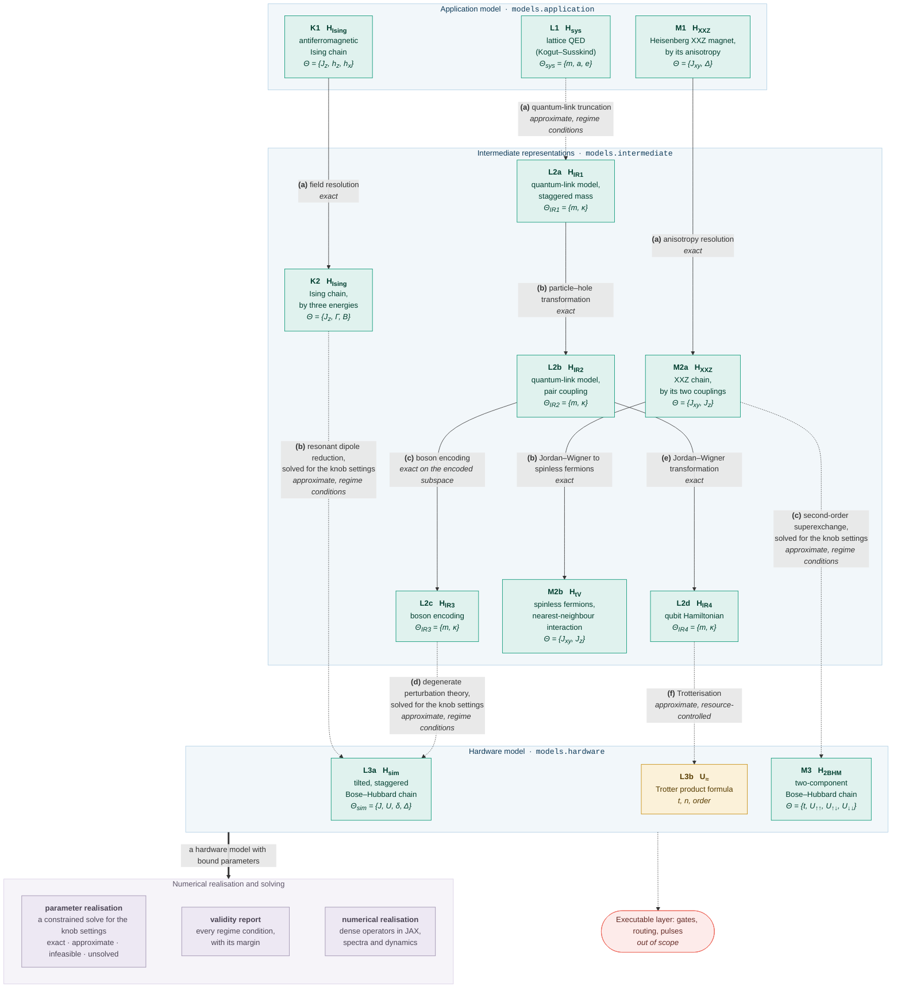

# Q-SiMod

A typed metamodel for the model-driven engineering (MDE) of quantum simulation.

Quantum simulation lets a controllable quantum system stand in for a physical quantum system
whose dynamics are classically intractable.  In practice it is a chain of modelling steps: the
Hamiltonian of a physical theory is subjected to truncations, changes of basis, encodings and
perturbative mappings until it arrives at a hardware model, which is either analogue, meaning
that a device realises the Hamiltonian natively, or digital, meaning a product formula to be
executed on a gate-based quantum computer.  Q-SiMod frames each of these steps as a
**transformation** between typed **artifacts**.  Every artifact carries a symbolic operator, a
structural type and a parameter set; every transformation declares the structural types it
requires and produces, whether it is **exact** or **approximate**, and its parameter relation.
A pipeline of transformations is **type-checked** before anything is computed, the **knob
settings** of a hardware model are found by a **solver** over the whole pipeline, with the
margin of every regime condition reported, and a **numerical realisation** layer validates the
declarations by exact diagonalisation (JAX) at small chain length.

The package implements the metamodel of the article it accompanies; see
[Citation](#citation).

## Digital and analogue simulation

{width=100%}

Both modes start from the same object: the dynamics of a physical system, governed by a
Hamiltonian `H_sys` and carried out by the unitary `U_sys` from the initial state at time `0`
to the target state at time `t`.  **Digital** simulation discretises that evolution into `n`
time slices, a *Trotterisation*, whose one- and two-qubit gates run on universal gate-based
hardware and realise an implicit, approximate Hamiltonian `H_≈`.  **Analogue** simulation maps
`H_sys` onto a Hamiltonian `H_sim` that a device realises natively and compiles it into
time-dependent control fields.  Both chains terminate in an instruction set: a universal gate
set, portable across gate-based machines, or an analogue instruction set tailored to one
platform.  Q-SiMod covers the chain down to the hardware model; the instruction sets
themselves are [out of scope](#out-of-scope).

## The metamodel

{width=100%}

The chain above is organised in three abstraction layers: an application model, the
intermediate representations it passes through, and a hardware model, which simulates either
in analogue mode, `H_sim`, or in digital mode, `U_≈`.  The nodes of that chain are the
artifacts and its edges the transformations, with the attributes each of them declares shown
beside them.  Because artifacts and transformations are declarative, nothing is computed to
type-check a pipeline; the **numerical realisation** layer on the right is separate and
optional, and it is what realises the operators, validates the transformations, solves the
parameter relations and measures the errors.

## The model graph

The artifacts and transformations the package implements, arranged by abstraction layer:



<!-- Generated by scripts/figures.py from the graphs themselves; do not edit by hand. -->

A **solid** arrow is an exact transformation and a **dotted** arrow an approximate one, with
the kind of approximation in italics.  Three physical theories descend from the application
layer through intermediate representations to the hardware layer, and two of them, the gauge
theory via `L2c` and the Ising chain via `K2`, arrive at the same hardware model `L3a`.

The `L…` artifacts form the case study of the article, a **one-dimensional lattice quantum
electrodynamics** carried to an analogue simulator model `H_sim` and a digital simulator model
`U_≈`
([Zhou et al., Science **377**, 311 (2022)](https://doi.org/10.1126/science.abl6277)); the
`M…` artifacts are a **Heisenberg magnet**
([Jepsen et al., Nature **588**, 403 (2020)](https://doi.org/10.1038/s41586-020-3033-y)), and
the `K…` artifacts an **Ising chain**
([Simon et al., Nature **472**, 307 (2011)](https://doi.org/10.1038/nature09994)).  Each use
case letters its own transformations.

---

## Install

The project uses [uv](https://docs.astral.sh/uv/) for the environment, and
[ruff](https://docs.astral.sh/ruff/), [ty](https://docs.astral.sh/ty/) and
[zensical](https://zensical.org/) for linting and formatting, type checking and the
documentation site.

```sh
uv sync --all-extras     # create the environment, including docs and dev tools
```

The runtime dependencies are `jax`, `jaxlib`, `numpy`, `pandas` and `scipy`.  `scipy` provides
the solver backend and is imported only by `qsimod/solving/backends/scipy_nlp.py`.

## Quickstart

The parameters of the application model are entered, the pipeline is type-checked, and the
knob settings of the hardware model that realise the request are found by the solver:

```python
from qsimod.usecases.schwinger import ParameterNames as P
from qsimod.usecases.schwinger import build_graph, device_limits
from qsimod.solving import realise_parameters

graph = build_graph(matter_sites=3)
print(graph.analogue)  # the pipeline, and what kind of approximation it is

targets = {P.MASS_L1: 0.02, P.COUPLING_L2A: 0.004525, P.ELECTRIC_GAP: 0.5}
print(graph.analogue.classify_relation(frozenset(targets)))
# UNDER_DETERMINED: 7 equation(s), 9 unknown(s) ...; 2 residual degree(s) of freedom

result = realise_parameters(
    graph.analogue,
    targets=targets,
    unknowns=[P.TUNNELLING, P.INTERACTION, P.SUPERLATTICE, P.TILT],
    admissible_set=device_limits(),
)
print(result)  # a status, a point, residuals, and every margin
```

The result carries a status: `EXACT_SOLUTION`, `APPROXIMATE_SOLUTION` with a per-parameter
residual, `INFEASIBLE` with the binding constraint named, which is proved by interval and
affine arithmetic over the declared boxes before any search runs, or `UNSOLVED`.

The digital branch, with the step count of the product formula found as an integer solve
against the a-priori error bound:

```python
from qsimod.solving.stepcount import minimal_steps
from qsimod.transformations import interleaved_layers_of
from qsimod.usecases.schwinger import trotterisation

qubits = ...  # a bound L2d model; see the examples
layers = interleaved_layers_of(qubits)
print(layers.commutation_report())  # which layer pairs commute, derived from the Pauli algebra
n = int(minimal_steps(layers, order=2, time=2.0, target_error=1e-3).point["L3b.n"])
print(trotterisation(time=2.0, steps=n, order=2).apply(qubits).resources())
```

## Layout

| Path | Contents |
|---|---|
| `qsimod/levels.py`, `scalar.py`, `affine.py`, `units.py`, `structure.py`, `symbolic.py`, `normal_form.py`, `parameters.py`, `artifact.py`, `relations.py`, `validity.py`, `transform.py`, `pipeline.py` | the **declaration layer**: symbolic artifacts, parameters, parameter relations, validity conditions, transformations and pipelines.  `normal_form.py` decides whether two symbolic sums are the same operator, which is how the claim of an `EXACT` transformation is checked.  No operator matrix is constructed and no solver is imported. |
| `qsimod/pauli.py`, `qsimod/trotter/` | the **structural layer**: reasoning on the term structure without constructing operators, namely commutation, layer decompositions, product formulas, a-priori error bounds and resource counts. |
| `qsimod/solving/` | the **solving layer**: parameter realisation, feasibility and step counts. |
| `qsimod/realise/`, `qsimod/jax_setup.py` | the **realisation layer**: dense `complex128` operators in JAX. |
| `qsimod/models/` | the **model library**, indexed by abstraction layer: `application`, `intermediate` and `hardware`, with `gauge` and `magnetism` for what each family of models shares. |
| `qsimod/transformations/` | the **transformation library**, indexed by the kind of operation: truncations, basis changes, encodings, reparametrisations, perturbative reductions and Trotterisation. |
| `qsimod/usecases/` | the **use cases**: which models, at which conventions, are related by which transformations and assembled into which model graph. |
| `examples/` | five runnable end-to-end examples. |
| `scripts/` | the two numerical studies of the article, which write `pandas` frames to `results/`, and the generator of the documentation figures. |
| `plots/` | the R scripts that draw the figures of the article from `results/`. |
| `docs/` | the documentation site: one guide per application model ([`schwinger.md`](docs/schwinger.md), [`heisenberg.md`](docs/heisenberg.md), [`ising.md`](docs/ising.md)) and an API reference generated from the docstrings. |

## Examples

```sh
uv run python examples/analogue_end_to_end.py    # the analogue branch, posed against Zhou et al. 2022
uv run python examples/infeasible_request.py     # an unreachable request, with the binding constraint named
uv run python examples/digital_end_to_end.py     # the digital branch, with the step count solved for
uv run python examples/heisenberg_end_to_end.py  # the Heisenberg magnet, posed against Jepsen et al. 2020
uv run python examples/shared_device.py          # two theories on one lattice, posed against Simon et al. 2011
```

## Numerical validation of the case study

The tables and figures of the article are produced by two scripts, at `N = 6` matter sites,
`m = 0`, `kappa = 14.5 Hz` and the experimental time window of 150 ms of Zhou et al. (2022):

```sh
uv run python scripts/zhou_trajectories.py --matter-sites 6 --realisation number-sector
uv run python scripts/zhou_digital.py --matter-sites 6
```

The first solves for the knob settings of the analogue simulator model and records the
trajectories of the mean matter occupation, the deviation from the effective theory, the
leakage and the gauge violation for the free and the prescribed knob settings; the second
records the resources, the a-priori error bounds and the measured deviations of the digital
simulator model over a ladder of step counts, and the step counts required to stay below given
deviation thresholds.  Each writes CSV files to `results/` (gitignored); `plots/plot.r` draws
the figures from them.  A run at `N = 6` takes several hours.

The documentation figures are generated from the model graphs the use cases build; they are
regenerated after adding an artifact or renaming a transformation (a test checks that they are
current):

```sh
uv run python scripts/figures.py                # rewrite every generated figure, in place
```

## Tests, linting, typing, docs

```sh
uv run pytest                     # the whole suite
uv run pytest -m "not slow"       # skip the documentation build and the wheel build
uv run ruff check                 # lint
uv run ruff format                # format, in place
uv run ty check                   # type check
uv run --extra docs zensical build --clean --strict   # the documentation site, into site/
```

`zensical` keeps a build cache in `.cache/`; a cache from an older version is reused after an
upgrade and renders cross-references as literal `[name][qsimod.thing]`.  `--clean` (used by
the test suite) or `rm -rf .cache` fixes it.

Every code snippet in the guide pages is extracted and executed by
`tests/test_docs_guide.py`.  `ruff` runs a broad rule set including pydocstyle and
flake8-annotations and is also the formatter, for the sources, for the code blocks in the
docstrings, and for the Python blocks in the Markdown pages.  `ty` runs with the rules it
leaves off by default turned on and its warnings promoted to errors, and `pytest` uses
`filterwarnings = ["error"]`.  The source carries no type-checker suppressions.

The tests are grouped by property: `tests/test_type_checking.py` (structural and kind type
checking), `test_regime_checking.py` (validity conditions and margins),
`test_semantic_preservation.py` (numerical agreement between abstraction layers),
`test_extensibility.py` (adding a hardware model from outside the package),
`test_engineering.py` (build and runnable examples), `test_solver.py` (parameter
realisation), `test_digital.py` (the digital branch), `test_core_conventions.py` (conventions
the other tests assume) and `test_docs_guide.py` (the guide snippets).

**JAX precision.**  Importing `qsimod` enables the 64-bit mode of JAX for the whole process,
since comparisons are made at tolerances of `1e-10`.  `qsimod.jax_setup` documents the switch,
`x64_enabled()` reports it, and `require_x64()` raises if it is off.

## Out of scope

The executable layer: the decomposition into a concrete gate set, qubit routing,
transpilation, scheduling and pulse schedules.  The digital branch ends at an ordered product
of exponentials of k-local Pauli terms, so the resource model counts k-local unitaries and
layers, not CNOTs.  Also absent are hardware backends and vendor SDKs, noise models, error
mitigation or correction, and a textual modelling language; the modelling language is the
Python API.  A test inspects the imports and the public API of the package to keep these
boundaries.

## Citation

The package implements the metamodel of this [paper](https://arxiv.org/abs/XXXX.XXXXX)

```bibtex
@misc{franz26_qsimod,
  author       = {Franz, Maja and Mauerer, Wolfgang},
  title        = {Gotta Model them All: Model-Driven Engineering of Quantum Simulation},
  year         = {2026},
  eprint       = {XXXX.XXXXX},
  archivePrefix = {arXiv},
  primaryClass = {quant-ph},
  url          = {https://arxiv.org/abs/XXXX.XXXXX},
}
```

which in turn builds on the vision presented in this paper [article](https://doi.org/10.1145/3786150.3788611)

```bibtex
@inproceedings{franz26_qse,
  author    = {Franz, Maja and Schmidbauer, Lukas and Ammermann, Joshua and
               Schaefer, Ina and Mauerer, Wolfgang},
  title     = {Towards Quantum Software for Quantum Simulation},
  year      = {2026},
  booktitle = {Proceedings of the 7th IEEE/ACM International Workshop on Quantum
               Software Engineering},
  pages     = {50--54},
  publisher = {Association for Computing Machinery},
  address   = {New York, NY, USA},
  isbn      = {9798400723834},
  doi       = {10.1145/3786150.3788611},
  url       = {https://doi.org/10.1145/3786150.3788611},
}
```
