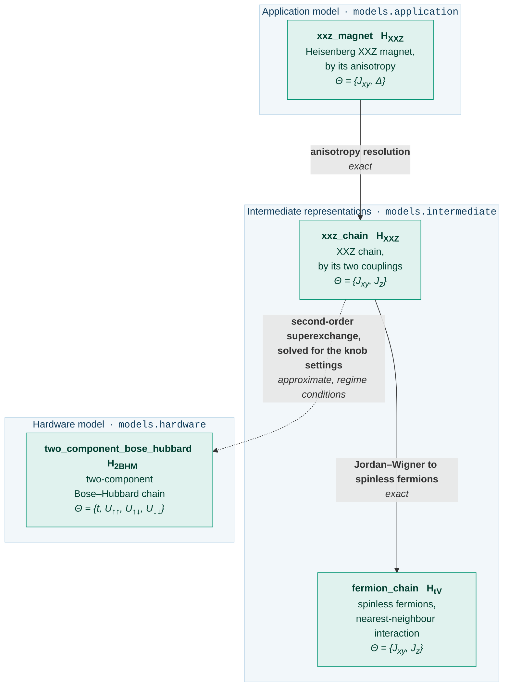

# Guide: the Heisenberg magnet

[`qsimod.usecases.heisenberg`][qsimod.usecases.heisenberg] carries an anisotropic Heisenberg
magnet, `xxz_magnet`, to a two-component optical lattice, the analogue simulator model
`two_component_bose_hubbard`.  It shares no artifact, transformation or convention with [the
Schwinger pipeline](schwinger.md), whose guide introduces [the attributes of a
transformation](schwinger.md#the-attributes-of-a-transformation), [the contents of an
artifact](schwinger.md#what-an-artifact-carries) and [how a transformation is
read](schwinger.md#reading-a-transformation); this page states what differs.

The physics follows Jepsen et al. [1]: Eq. (1) of that article is `xxz_chain`, and the Methods
section "Extended Hubbard model" is the superexchange reduction.

## The model graph

<!-- Generated by scripts/figures.py from the graph this use case builds; do not edit by hand. -->



| | Schwinger | Heisenberg |
|---|---|---|
| physical theory | one-dimensional lattice gauge theory | quantum magnetism |
| register | interleaved matter sites and links, `2N-1` positions | a chain of `N` positions, or `2N` for two components |
| symmetry | **local** U(1), one generator per site | **global** U(1), the total magnetisation |
| hardware model | tilted, staggered optical superlattice | two-component lattice near a Feshbach resonance |
| knobs | `J`, `U`, `delta`, `Delta` | `t`, `U_uu`, `U_ud`, `U_dd` |
| terminal artifacts | two hardware models of two artifact kinds | two, of which one is a hardware model |

`fermion_chain` is a terminal artifact of the intermediate layer: at $J_z = 0$ it is a
free-fermion model.  The abstraction level is data on an artifact, not a type:

```python
from qsimod.usecases.heisenberg import build_graph

graph = build_graph(4)
print(graph.targets())  # ('fermion_chain', 'two_component_bose_hubbard')
for node, level in graph.levels().items():
    print(f"{node:5} {level}")
```

## The transformations at a glance

| Transformation | From | To | Exactness | Kind of approximation | Relation, forward | Relation, inverse |
|---|---|---|---|---|---|---|
| [anisotropy resolution][qsimod.transformations.reparametrisations.anisotropy_resolution] | `xxz_magnet` | `xxz_chain` | `EXACT` | — | `CLOSED_FORM` | `CLOSED_FORM` |
| [Jordan-Wigner transformation to fermions][qsimod.transformations.basis_changes.jordan_wigner_to_fermions] | `xxz_chain` | `fermion_chain` | `EXACT` | — | `CLOSED_FORM` | `CLOSED_FORM` |
| [superexchange reduction][qsimod.transformations.perturbative.superexchange_reduction] | `xxz_chain` | `two_component_bose_hubbard` | `APPROXIMATE` | regime conditions | `CLOSED_FORM` | **`UNDER_DETERMINED`** |

## `xxz_magnet`: the XXZ magnet

**Use case:** [`magnet`][qsimod.usecases.heisenberg.magnet] &nbsp;·&nbsp; **library:** [`heisenberg_magnet`][qsimod.models.application.heisenberg_magnet]

$$
\hat H_\text{XXZ} = \sum_j \left[ J_{xy} \left( \hat S^x_j \hat S^x_{j+1} + \hat S^y_j \hat S^y_{j+1} \right) + \Delta J_{xy}\, \hat S^z_j \hat S^z_{j+1} \right]
$$

One energy $J_{xy}$ and one dimensionless anisotropy $\Delta = J_z / J_{xy}$: $\Delta = 0$ is the free-fermion
XX point, $\Delta = 1$ the isotropic Heisenberg magnet, and $\lvert \Delta \rvert > 1$ the Ising-like regimes.  The
structural type declares spin-1/2 degrees of freedom on a chain of $N$ sites with a global U(1)
symmetry, the conservation of the total magnetisation.  Unlike the lattice gauge theory, the
application model has a finite-dimensional representation:

```python
from qsimod.realise import HilbertSpace, build_operator
from qsimod.usecases.heisenberg import ParameterNames as P, magnet

model = magnet(4)
print(model.parameters)  # xxz_magnet.Jxy [rad/ms], xxz_magnet.Delta
space = HilbertSpace.of(model.structure)
print(space.dimension)  # 16
operator = build_operator(
    model.hamiltonian, space, {P.TRANSVERSE_XXZ_MAGNET: 0.5, P.ANISOTROPY: 1.0}
)
print(operator.shape)  # (16, 16)
```

## `xxz_magnet` -> `xxz_chain`: the anisotropy resolution

$$
J_{xy} \to J_{xy}, \qquad J_z = \Delta\, J_{xy}
$$

**Exactness:** `EXACT`, a reparametrisation that leaves the operators unchanged.  The relation
is not an [identity relation][qsimod.relations.identity_relation], since one parameter is the
product of two others, but it is invertible:

```python
from qsimod.usecases.heisenberg import ParameterNames as P, anisotropy

step = anisotropy()
print(step.relation)
print(step.forward_relation_kind)  # CLOSED_FORM
print(step.inverse_relation_kind)  # CLOSED_FORM
print(
    step.relation.is_invertible(
        {P.TRANSVERSE_XXZ_MAGNET, P.ANISOTROPY}, {P.TRANSVERSE_XXZ_CHAIN, P.LONGITUDINAL_XXZ_CHAIN}
    )
)  # True
```

## `xxz_chain`: the XXZ chain by two couplings

**Use case:** [`spin_chain`][qsimod.usecases.heisenberg.spin_chain] &nbsp;·&nbsp; **library:** [`xxz_spin_chain`][qsimod.models.intermediate.xxz_spin_chain]

$$
\hat H_\text{XXZ} = \sum_{j=0}^{N-2} \left[ \frac{J_{xy}}{2} \left( \hat S^+_j \hat S^-_{j+1} + \text{h.c.} \right) + J_z\, \hat S^z_j \hat S^z_{j+1} \right]
$$

The Hamiltonian of `xxz_magnet`, parametrised by the two coupling energies $J_{xy}$ and $J_z$; the
transverse term is stored in the ladder basis of [`Algebra.SPIN_HALF`][qsimod.structure.Algebra].

## `xxz_chain` -> `fermion_chain`: the Jordan-Wigner transformation to spinless fermions

$$
\hat S^+_j \to \hat c_j^\dagger \prod_{k<j} (1 - 2 \hat n_k), \qquad \hat S^z_j \to \hat n_j - \tfrac12
$$

**Exactness:** `EXACT`.  The structural type changes from spin-1/2 to fermions on the same $N$
positions; the transverse term becomes a hopping, the longitudinal term a nearest-neighbour
interaction, and the parity strings cancel because the couplings join adjacent sites.  With the
alternating-sign convention of the numerical realisation the two models are the same matrix:

```python
import numpy as np

from qsimod.realise import HilbertSpace, build_operator
from qsimod.usecases.heisenberg import ParameterNames as P, fermion_chain, spin_chain

values = {"Jxy": 0.5, "Jz": 0.35}
spin, fermions = spin_chain(6), fermion_chain(6)
left = build_operator(
    spin.hamiltonian,
    HilbertSpace.of(spin.structure),
    {P.TRANSVERSE_XXZ_CHAIN: values["Jxy"], P.LONGITUDINAL_XXZ_CHAIN: values["Jz"]},
)
right = build_operator(
    fermions.hamiltonian,
    HilbertSpace.of(fermions.structure),
    {P.TRANSVERSE_FERMION_CHAIN: values["Jxy"], P.LONGITUDINAL_FERMION_CHAIN: values["Jz"]},
)
print(float(np.max(np.abs(np.asarray(left) - np.asarray(right)))) < 1e-12)  # True
```

## `fermion_chain`: the Jordan-Wigner image

**Use case:** [`fermion_chain`][qsimod.usecases.heisenberg.fermion_chain] &nbsp;·&nbsp; **library:** [`interacting_fermion_chain`][qsimod.models.intermediate.interacting_fermion_chain]

$$
\hat H_{tV} = -\frac{J_{xy}}{2} \sum_j \left( \hat c_j^\dagger \hat c_{j+1} + \text{h.c.} \right)
  + J_z \sum_j \hat n_j \hat n_{j+1} - \frac{J_z}{2} \sum_j z_j \hat n_j + \frac{(N-1) J_z}{4}
$$

$z_j$ is the coordination number, `1` at the ends and `2` in the bulk; the last two terms are
the expansion of $J_z \sum_{j} (\hat n_j - 1/2)(\hat n_{j+1} - 1/2)$, and the constant is retained.  At
$J_z = 0$ the model is free, with the band $-J_{xy} \cos(qa)$.  The leading minus sign is the
alternating-sign Jordan-Wigner convention of [`qsimod.realise.build`][qsimod.realise.build];
the plain convention differs by $\hat c_j \to (-1)^j \hat c_j$, which changes neither the spectrum nor the
Fermi velocity.

## `xxz_chain` -> `two_component_bose_hubbard`: the second-order superexchange

$$
J_{xy} = -\frac{4t^2}{U_{\uparrow\downarrow}}, \qquad
J_z = \frac{4t^2}{U_{\uparrow\downarrow}} - \frac{4t^2}{U_{\uparrow\uparrow}} - \frac{4t^2}{U_{\downarrow\downarrow}}
$$

At one atom per site, virtual tunnelling onto a neighbouring site and back yields a spin-spin
coupling.  Only the interspecies channel exchanges two spins, so it alone sets $J_{xy}$, whereas all
three channels contribute to $J_z$.

**Exactness:** `APPROXIMATE`; the leading error is of fourth order in $t$, a relative error
scaling like $(t/U)^2$.

**Validity conditions.**  Three domain and six regime conditions:

| Condition | Severity | Quantity | Threshold |
|---|---|---|---|
| `pole: U_uu != 0` | domain | `abs(U_uu)/t` | 1e-3 |
| `pole: U_ud != 0` | domain | `abs(U_ud)/t` | 1e-3 |
| `pole: U_dd != 0` | domain | `abs(U_dd)/t` | 1e-3 |
| `t << U_uu` | regime | `t/U_uu` | 0.1 |
| `t << U_ud` | regime | `t/U_ud` | 0.1 |
| `t << U_dd` | regime | `t/U_dd` | 0.1 |
| `abs(Jxy) << U_ud` | regime | `abs(Jxy/U_ud)` | 0.1 |
| `abs(Jz) << U_uu` | regime | `abs(Jz/U_uu)` | 0.1 |
| `abs(Jz) << U_dd` | regime | `abs(Jz/U_dd)` | 0.1 |

Since $\Delta + 1 = U_{\uparrow\downarrow}/U_{\uparrow\uparrow} + U_{\uparrow\downarrow}/U_{\downarrow\downarrow}$, a large anisotropy requires a small intraspecies
channel, where $\lvert J_z \rvert \ll U_{\uparrow\uparrow}$ binds independently of $t \ll U_{\uparrow\uparrow}$.

```python
from qsimod.usecases.heisenberg import ParameterNames as P, superexchange, validity

step = superexchange()
print(step.inverse_relation_kind)  # UNDER_DETERMINED
report = validity().report(
    {
        P.HOPPING: 3.0,
        P.INTERACTION_UP: -51.6,
        P.INTERACTION_MIXED: -72.1,
        P.INTERACTION_DOWN: -125.4,
        P.TRANSVERSE_XXZ_CHAIN: 0.4975,
        P.LONGITUDINAL_XXZ_CHAIN: 0.4841,
    }
)
print(report)
```

The forward maps take the four knobs to the two couplings; the transformation poses the inverse
direction, two equations in four unknowns, as a solve, and returns the target with its
parameters unbound.

### What the superexchange also produces

The derivation also yields a longitudinal field

$$
-\frac{A - B}{2} \sum_j z_j \hat S^z_j, \qquad A = \frac{4t^2}{U_{\uparrow\uparrow}}, \quad B = \frac{4t^2}{U_{\downarrow\downarrow}}
$$

for which the XXZ Hamiltonian has no term; at the settings of the reference experiment it
amounts to about 40 % of $J_{xy}$.
[`superexchange_field`][qsimod.transformations.perturbative.superexchange_field] returns its
strength and
[`weighted_magnetisation_term`][qsimod.models.magnetism.weighted_magnetisation_term] builds the
operator:

```python
from qsimod.usecases.heisenberg import ParameterNames as P, field_map, transverse_map

knobs = {
    P.HOPPING: 3.0,
    P.INTERACTION_UP: -51.6,
    P.INTERACTION_MIXED: -72.1,
    P.INTERACTION_DOWN: -125.4,
}
print(round(field_map().evaluate_real(knobs) / transverse_map().evaluate_real(knobs), 3))
# 0.411
```

Since $\sum_{j} z_j \hat S^z_j = 2 \sum_{j} \hat S^z_j - \hat S^z_0 - \hat S^z_{N-1}$ and the total magnetisation is
conserved, the term is a constant inside a magnetisation sector plus a field on the two end
spins.  It vanishes at $U_{\uparrow\uparrow} = U_{\downarrow\downarrow}$, where the default objective places the solve.
`examples/heisenberg_end_to_end.py` reports the deviation of the spectra with and without it.

## `two_component_bose_hubbard`: the two-component optical lattice

**Use case:** [`lattice`][qsimod.usecases.heisenberg.lattice] &nbsp;·&nbsp; **library:** [`two_component_bose_hubbard_chain`][qsimod.models.hardware.two_component_bose_hubbard_chain]

$$
\begin{aligned}
\hat H_\text{2BHM} = {}& -t \sum_\sigma \sum_{j=0}^{N-2} \left( \hat b_{j,\sigma}^\dagger \hat b_{j+1,\sigma} + \text{h.c.} \right)
  + \frac{U_{\uparrow\uparrow}}{2} \sum_j \hat n_{j\uparrow} (\hat n_{j\uparrow} - 1) \\
  & + \frac{U_{\downarrow\downarrow}}{2} \sum_j \hat n_{j\downarrow} (\hat n_{j\downarrow} - 1)
  + U_{\uparrow\downarrow} \sum_j \hat n_{j\uparrow} \hat n_{j\downarrow}
\end{aligned}
$$

Two hyperfine states share one lattice on an interleaved register: component `up` occupies
position $2j$ and component `down` position $2j+1$, so $N$ chain sites occupy $2N$ positions.
The knobs are the tunnelling $t$ and the three interaction channels:

```python
from qsimod.usecases.heisenberg import device_limits

for line in str(device_limits()).split("; "):
    print(line)
```

$U_{\downarrow\downarrow}$ may take either sign, since an anisotropy below `-1` requires a negative value; the
excluded value $U_{\downarrow\downarrow} = 0$ is the midpoint of the box, so
[`device_start`][qsimod.usecases.heisenberg.device_start] chooses the branch from the requested
anisotropy.  The coupled constraints are the Mott lobe, `|U| >= 3.4 t` per channel, an operating
limit of the apparatus that is weaker than the regime condition $t \ll U$.

The artifact declares its conserved sector, the total particle number at unit filling, and no
term leaves it, so a realisation inside the sector is exact:

```python
from qsimod.realise import RealisationRequest, SectorBasis
from qsimod.usecases.heisenberg import lattice

model = lattice(4)
print(model.sector)  # unit filling [N_0=+4]
basis = SectorBasis.of(
    model.structure,
    constraints=model.constraint_operators,
    request=RealisationRequest(boson_cutoff=2),
)
print(basis.dimension, "of", basis.space.dimension)  # 266 of 6561
```

The one-atom-per-site manifold is neither the ground state nor the middle of the spectrum on
the attractive branch; it is identified by its weight on the configurations that
[`mott_manifold_operators`][qsimod.models.magnetism.mott_manifold_operators] declares.

## References

1. P. N. Jepsen, J. Amato-Grill, I. Dimitrova, W. W. Ho, E. Demler and W. Ketterle, *Spin
   transport in a tunable Heisenberg model realized with ultracold atoms*, Nature **588**,
   403-407 (2020). [doi:10.1038/s41586-020-3033-y](https://doi.org/10.1038/s41586-020-3033-y)
