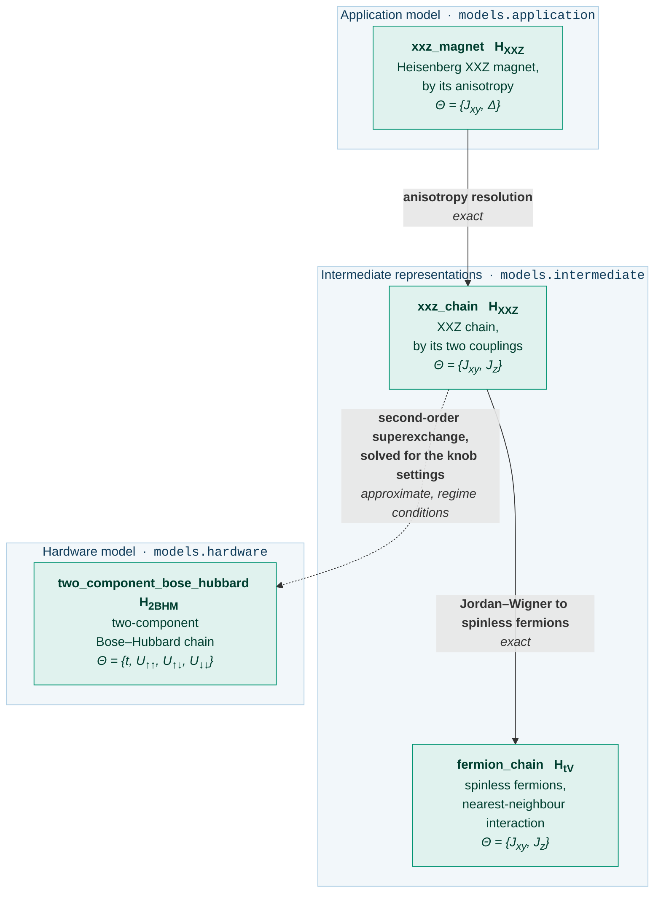

# Guide: the Heisenberg magnet

The use case [`qsimod.usecases.heisenberg`][qsimod.usecases.heisenberg] carries an anisotropic
Heisenberg magnet, the application model `xxz_magnet`, to a two-component optical lattice, the
analogue simulator model `two_component_bose_hubbard`.  It shares no artifact, transformation or convention with [the
Schwinger pipeline](schwinger.md).  This page assumes the machinery that guide introduces,
namely [the attributes of a transformation](schwinger.md#the-attributes-of-a-transformation),
[the contents of an artifact](schwinger.md#what-an-artifact-carries) and [how a transformation
is read](schwinger.md#reading-a-transformation), and states what differs.

The physics follows Jepsen et al., *Spin transport in a tunable Heisenberg model realized with
ultracold atoms*, Nature **588**, 403-407 (2020): Eq. (1) of that article is `xxz_chain`, and the
Methods section "Extended Hubbard model" is the superexchange reduction.

## The model graph

A dotted arrow is an approximate transformation and a solid arrow an exact one.

<!-- Generated by scripts/figures.py from the graph this use case builds; do not edit by hand. -->



| | Schwinger | Heisenberg |
|---|---|---|
| physical theory | one-dimensional lattice gauge theory | quantum magnetism |
| register | interleaved matter sites and links, `2N-1` positions | a chain of `N` positions, or `2N` for two components |
| symmetry | **local** U(1), one generator per site | **global** U(1), the total magnetisation |
| hardware model | tilted, staggered optical superlattice | two-component lattice near a Feshbach resonance |
| knobs | `J`, `U`, `delta`, `Delta` | `t`, `U_uu`, `U_ud`, `U_dd` |
| terminal artifacts | two hardware models of two artifact kinds | two, of which one is a hardware model |

```python
from qsimod.usecases.heisenberg import build_graph

graph = build_graph(4)
print(graph.targets())  # ('fermion_chain', 'two_component_bose_hubbard')
for node, level in graph.levels().items():
    print(f"{node:5} {level}")
```

`fermion_chain` is a terminal artifact of the intermediate layer: at `Jz = 0` it is a free-fermion model.
The abstraction level is data on an artifact, not a type; `graph.graph.branches("xxz_magnet")` lists
the branches.

## The transformations at a glance

| Transformation | From | To | Exactness | Kind of approximation | Relation, forward direction | Relation, inverse direction |
|---|---|---|---|---|---|---|
| [anisotropy resolution][qsimod.transformations.reparametrisations.anisotropy_resolution] | `xxz_magnet` | `xxz_chain` | `EXACT` | — | `CLOSED_FORM` | `CLOSED_FORM` |
| [Jordan-Wigner transformation to fermions][qsimod.transformations.basis_changes.jordan_wigner_to_fermions] | `xxz_chain` | `fermion_chain` | `EXACT` | — | `CLOSED_FORM` | `CLOSED_FORM` |
| [superexchange reduction][qsimod.transformations.perturbative.superexchange_reduction] | `xxz_chain` | `two_component_bose_hubbard` | `APPROXIMATE` | regime conditions | `CLOSED_FORM` | **`UNDER_DETERMINED`** |

The relation of the superexchange reduction is derived from the hardware model to the
theory; in the
inverse direction, the knob settings are found by a solve.

## `xxz_magnet`: the XXZ magnet

**Use case:** [`magnet`][qsimod.usecases.heisenberg.magnet] &nbsp;·&nbsp; **library:** [`heisenberg_magnet`][qsimod.models.application.heisenberg_magnet]

```
H_XXZ = sum_j [ Jxy ( S^x_j S^x_{j+1} + S^y_j S^y_{j+1} ) + Delta Jxy S^z_j S^z_{j+1} ]
```

The model has one energy `Jxy` and one dimensionless anisotropy `Delta = Jz / Jxy`: `0` is
the free-fermion XX point, `1` the isotropic Heisenberg magnet, and `|Delta| > 1` are the
Ising-like regimes.  The structural type declares spin-1/2 degrees of freedom on a chain of `N`
sites with a global U(1) symmetry, the conservation of the total magnetisation.  Unlike the
lattice gauge theory, the application model has a finite-dimensional representation:

```python
from qsimod.realise import HilbertSpace, build_operator
from qsimod.usecases.heisenberg import ParameterNames as P, magnet

model = magnet(4)
print(model.parameters)  # xxz_magnet.Jxy [rad/ms], xxz_magnet.Delta
space = HilbertSpace.of(model.structure)
print(space.dimension)  # 16
operator = build_operator(
    model.hamiltonian, space, {P.TRANSVERSE_XXZ_MAGNET: 0.5, P.ANISOTROPY: 1.0}
)
print(operator.shape)  # (16, 16)
```

The transverse term is stored in the ladder basis, `(Jxy/2)(S^+ S^- + h.c.)`, the operator
vocabulary of [`Algebra.SPIN_HALF`][qsimod.structure.Algebra].

## `xxz_magnet` -> `xxz_chain`: the anisotropy resolution

```
Jxy -> Jxy        (carried over)
Jz  =  Delta * Jxy
```

**Exactness:** `EXACT`.  The transformation is a reparametrisation: the operators and the
algebra are unchanged.  The relation is not an [identity
relation][qsimod.relations.identity_relation], since one parameter is the product of two
others, and classifies as invertible:

```python
from qsimod.usecases.heisenberg import ParameterNames as P, anisotropy

step = anisotropy()
print(step.relation)
print(step.forward_relation_kind)  # CLOSED_FORM
print(step.inverse_relation_kind)  # CLOSED_FORM
print(
    step.relation.is_invertible(
        {P.TRANSVERSE_XXZ_MAGNET, P.ANISOTROPY}, {P.TRANSVERSE_XXZ_CHAIN, P.LONGITUDINAL_XXZ_CHAIN}
    )
)  # True
```

## `xxz_chain`: the XXZ chain by two couplings

**Use case:** [`spin_chain`][qsimod.usecases.heisenberg.spin_chain] &nbsp;·&nbsp; **library:** [`xxz_spin_chain`][qsimod.models.intermediate.xxz_spin_chain]

```
H_XXZ = sum_{j=0}^{N-2} [ (Jxy/2)( S^+_j S^-_{j+1} + h.c. ) + Jz S^z_j S^z_{j+1} ]
```

This is the Hamiltonian of `xxz_magnet`, parametrised by the two coupling energies `Jxy` and `Jz`.

## `xxz_chain` -> `fermion_chain`: the Jordan-Wigner transformation to spinless fermions

```
S^+_j -> c^dag_j prod_{k<j} (1 - 2 n_k)        S^z_j -> n_j - 1/2
```

**Exactness:** `EXACT`.  The structural type changes from spin-1/2 to fermions on the same
`N` positions.  The transverse term becomes a hopping and the longitudinal term a
nearest-neighbour interaction.  The parity strings cancel because the couplings join adjacent
sites:

```python
import numpy as np

from qsimod.realise import HilbertSpace, build_operator
from qsimod.usecases.heisenberg import ParameterNames as P, fermion_chain, spin_chain

values = {"Jxy": 0.5, "Jz": 0.35}
spin, fermions = spin_chain(6), fermion_chain(6)
left = build_operator(
    spin.hamiltonian,
    HilbertSpace.of(spin.structure),
    {P.TRANSVERSE_XXZ_CHAIN: values["Jxy"], P.LONGITUDINAL_XXZ_CHAIN: values["Jz"]},
)
right = build_operator(
    fermions.hamiltonian,
    HilbertSpace.of(fermions.structure),
    {P.TRANSVERSE_FERMION_CHAIN: values["Jxy"], P.LONGITUDINAL_FERMION_CHAIN: values["Jz"]},
)
print(float(np.max(np.abs(np.asarray(left) - np.asarray(right)))) < 1e-12)  # True
```

The two matrices are identical, since the model carries the alternating-sign Jordan-Wigner
convention of the numerical realisation; see [`fermion_chain`](#fermion_chain-the-jordan-wigner-image).

## `fermion_chain`: the Jordan-Wigner image

**Use case:** [`fermion_chain`][qsimod.usecases.heisenberg.fermion_chain] &nbsp;·&nbsp; **library:** [`interacting_fermion_chain`][qsimod.models.intermediate.interacting_fermion_chain]

```
H_tV = - (Jxy/2) sum_j ( c^dag_j c_{j+1} + h.c. )
     + Jz sum_j n_j n_{j+1}  -  (Jz/2) sum_j z_j n_j  +  (N-1) Jz/4
```

`z_j` is the coordination number, `1` at the ends and `2` in the bulk
([`coordination_numbers`][qsimod.models.magnetism.coordination_numbers]).  The last two terms
are the expansion of `Jz sum_j (n_j - 1/2)(n_{j+1} - 1/2)`; the constant is retained.

At `Jz = 0` the model is free: the single-particle band is `-Jxy cos(qa)`, the bandwidth is
`2 Jxy`, and the Fermi velocity at half filling is `a Jxy`.

!!! note "The leading minus sign is the Jordan-Wigner convention"

    [`qsimod.realise.build`][qsimod.realise.build] uses the alternating-sign convention, one
    minus sign per bond, so this Hamiltonian and the spin chain are realised as the same
    matrix.  Under the plain convention the coefficient is `+Jxy/2` and the band
    `+Jxy cos(qa)`; the two conventions differ by `c_j -> (-1)^j c_j`, a relabelling of the band
    by `pi/a` that changes neither the spectrum nor the velocity.

## `xxz_chain` -> `two_component_bose_hubbard`: the second-order superexchange

```
Jxy = -4 t^2 / U_ud
Jz  =  4 t^2 / U_ud - ( 4 t^2 / U_uu + 4 t^2 / U_dd )
```

At one atom per site, virtual tunnelling onto a neighbouring site and back yields a spin-spin
coupling.  Only the interspecies channel exchanges two spins, so it alone sets `Jxy`, whereas
all three channels contribute to `Jz`.

**Exactness:** `APPROXIMATE`, valid within a declared regime.  The leading error is of fourth
order in `t`, a relative error scaling like `(t/U)^2`.

**Validity conditions.**  Three domain and six regime conditions:

| Condition | Severity | Quantity | Threshold |
|---|---|---|---|
| `pole: U_uu != 0` | domain | `abs(U_uu)/t` | 1e-3 |
| `pole: U_ud != 0` | domain | `abs(U_ud)/t` | 1e-3 |
| `pole: U_dd != 0` | domain | `abs(U_dd)/t` | 1e-3 |
| `t << U_uu` | regime | `t/U_uu` | 0.1 |
| `t << U_ud` | regime | `t/U_ud` | 0.1 |
| `t << U_dd` | regime | `t/U_dd` | 0.1 |
| `abs(Jxy) << U_ud` | regime | `abs(Jxy/U_ud)` | 0.1 |
| `abs(Jz) << U_uu` | regime | `abs(Jz/U_uu)` | 0.1 |
| `abs(Jz) << U_dd` | regime | `abs(Jz/U_dd)` | 0.1 |

Since `Delta + 1 = U_ud/U_uu + U_ud/U_dd`, a large anisotropy requires a small intraspecies
channel, where the condition `|Jz| << U_uu` binds independently of `t << U_uu`.

```python
from qsimod.usecases.heisenberg import ParameterNames as P, superexchange, validity

step = superexchange()
print(step.inverse_relation_kind)  # UNDER_DETERMINED
report = validity().report(
    {
        P.HOPPING: 3.0,
        P.INTERACTION_UP: -51.6,
        P.INTERACTION_MIXED: -72.1,
        P.INTERACTION_DOWN: -125.4,
        P.TRANSVERSE_XXZ_CHAIN: 0.4975,
        P.LONGITUDINAL_XXZ_CHAIN: 0.4841,
    }
)
print(report)
```

**Software perspective.**  The forward direction of the derivation maps the four knobs to the
two couplings; the transformation poses the inverse direction, two equations in four unknowns,
as a solve for the knob settings, and the target artifact is returned with its parameters
unbound.

### What the superexchange also produces

The derivation also yields a longitudinal field

```
-(A - B)/2 * sum_j z_j S^z_j ,    A = 4t^2/U_uu ,  B = 4t^2/U_dd
```

for which the XXZ Hamiltonian has no term.  At the settings of the reference experiment it
amounts to about 40 % of `Jxy`.
[`superexchange_field`][qsimod.transformations.perturbative.superexchange_field] returns its
strength and
[`weighted_magnetisation_term`][qsimod.models.magnetism.weighted_magnetisation_term] builds the
operator.

```python
from qsimod.usecases.heisenberg import ParameterNames as P, field_map, transverse_map

knobs = {
    P.HOPPING: 3.0,
    P.INTERACTION_UP: -51.6,
    P.INTERACTION_MIXED: -72.1,
    P.INTERACTION_DOWN: -125.4,
}
print(round(field_map().evaluate_real(knobs) / transverse_map().evaluate_real(knobs), 3))
# 0.411
```

Since `sum_j z_j S^z_j = 2 sum_j S^z_j - S^z_0 - S^z_{N-1}` and the total magnetisation is
conserved, the term is a constant inside a magnetisation sector plus a field on the two end
spins.  It vanishes identically at `U_uu = U_dd`, which is where the default objective, the
maximisation of the weakest margin that balances the `t << U` conditions, places the solve.
`examples/heisenberg_end_to_end.py` reports the deviation of the spectra with and without the
term.

## `two_component_bose_hubbard`: the two-component optical lattice

**Use case:** [`lattice`][qsimod.usecases.heisenberg.lattice] &nbsp;·&nbsp; **library:** [`two_component_bose_hubbard_chain`][qsimod.models.hardware.two_component_bose_hubbard_chain]

```
H_2BHM = - t sum_{sigma} sum_{j=0}^{N-2} ( b^dag_{j,sigma} b_{j+1,sigma} + h.c. )
       + (U_uu/2) sum_j n_{j,up} (n_{j,up} - 1)
       + (U_dd/2) sum_j n_{j,down} (n_{j,down} - 1)
       + U_ud     sum_j n_{j,up} n_{j,down}
```

Two hyperfine states share one lattice on the interleaved register of
[`two_component_structure`][qsimod.models.magnetism.two_component_structure]: component `up`
occupies position `2j` and component `down` position `2j+1`, so `N` chain sites occupy `2N`
positions.  The knobs are the tunnelling `t` and the three interaction channels `U_uu`, `U_ud`
and `U_dd`.

```python
from qsimod.usecases.heisenberg import device_limits

for line in str(device_limits()).split("; "):
    print(line)
```

* `U_dd` may take either sign, since the scattering length crosses zero inside the usable
  field window and an anisotropy below `-1` requires a negative value.  The midpoint of the
  box is the excluded value `U_dd = 0`, so
  [`device_start`][qsimod.usecases.heisenberg.device_start] supplies a starting point and
  chooses the branch from the requested anisotropy.
* The coupled constraints are the Mott lobe, `|U| >= 3.4 t` per channel, an operating limit of
  the apparatus that is weaker than the perturbative regime condition `t << U` the
  transformation declares.

The artifact declares its conserved sector, the total particle number, which unit filling fixes
at `N`:

```python
from qsimod.realise import RealisationRequest, SectorBasis
from qsimod.usecases.heisenberg import lattice

model = lattice(4)
print(model.sector)  # unit filling [N_0=+4]
basis = SectorBasis.of(
    model.structure,
    constraints=model.constraint_operators,
    request=RealisationRequest(boson_cutoff=2),
)
print(basis.dimension, "of", basis.space.dimension)  # 266 of 6561
```

No term leaves the sector, so a realisation inside it is exact.

!!! warning "The manifold is neither the ground state nor the middle of the spectrum"

    On the attractive branch a doubly occupied site lies below the one-atom-per-site
    manifold, and where the channels differ in sign a pair of compensating doublons lies near
    zero energy.  The manifold is identified by its weight on the configurations that
    [`mott_manifold_operators`][qsimod.models.magnetism.mott_manifold_operators] declares;
    `examples/heisenberg_end_to_end.py` reports that weight.
