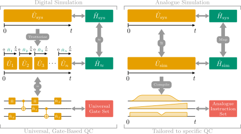
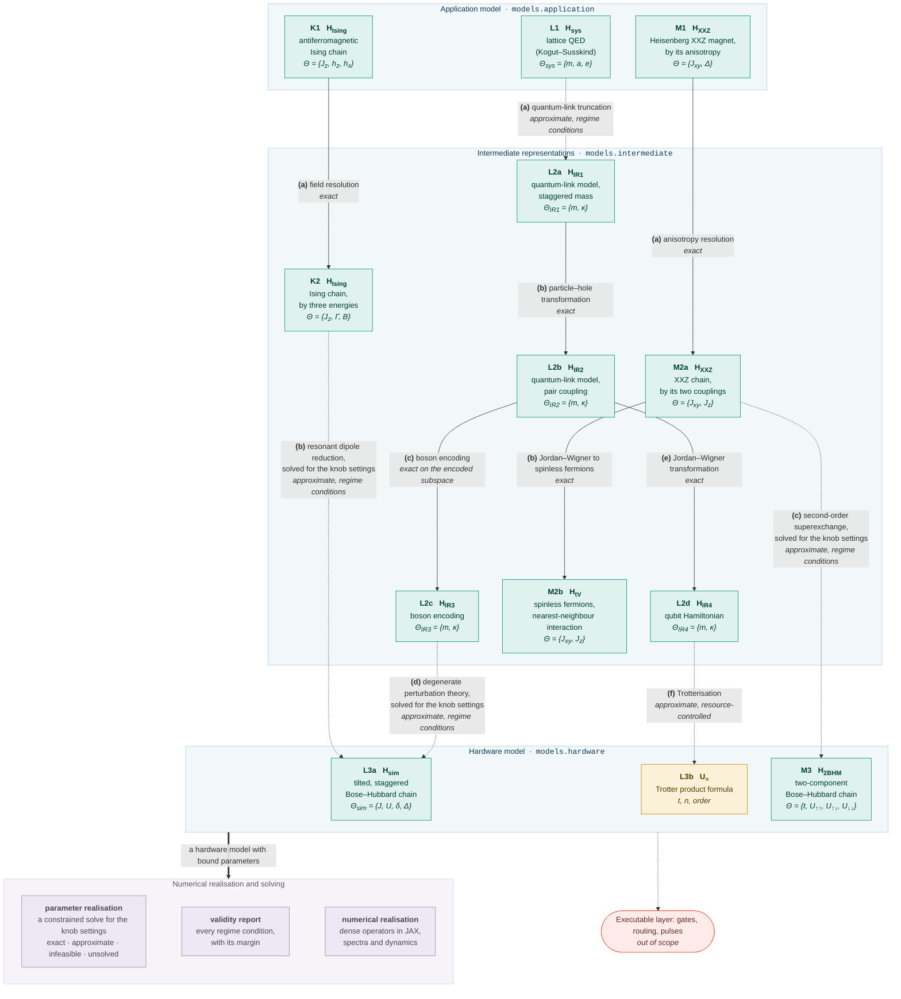

# Q-SiMod

A typed metamodel for the model-driven engineering (MDE) of quantum simulation.

Quantum simulation lets a controllable quantum system stand in for a physical quantum system
whose dynamics are classically intractable.  In practice it is a chain of modelling steps: the
Hamiltonian of a physical theory is subjected to truncations, changes of basis, encodings and
perturbative mappings until it arrives at a hardware model, which is either analogue, meaning
that a device realises the Hamiltonian natively, or digital, meaning a product formula to be
executed on a gate-based quantum computer.  Q-SiMod frames each of these steps as a
transformation between typed artifacts.  Every artifact carries a symbolic operator, a
structural type and a parameter set; every transformation declares the structural types it
requires and produces, whether it is exact or approximate, and its parameter relation.  A
pipeline of transformations is type-checked before anything is computed, the knob settings of
a hardware model are found by a solver over the whole pipeline, and a numerical realisation
layer validates the declarations by exact diagonalisation at small chain length.

The package implements the metamodel of the article it accompanies; see
[Citation](#citation).

## Digital and analogue simulation

{width=100%}

Both modes start from the same object: the dynamics of a physical system, governed by a
Hamiltonian $\hat H_\text{sys}$ and carried out by the unitary $\hat U_\text{sys}$ from the initial state at time $0$
to the target state at time $t$.  **Digital** simulation discretises that evolution into `n`
time slices, a *Trotterisation*, whose one- and two-qubit gates run on universal gate-based
hardware and realise an implicit, approximate Hamiltonian $\hat H_\approx$.  **Analogue** simulation maps
$\hat H_\text{sys}$ onto a Hamiltonian $\hat H_\text{sim}$ that a device realises natively and compiles it into
time-dependent control fields.  Both chains terminate in an instruction set: a universal gate
set, portable across gate-based machines, or an analogue instruction set tailored to one
platform.  The case study carries one physical theory down both branches, in the guide to [the
lattice Schwinger model](schwinger.md); the instruction sets themselves are out of scope.

## The metamodel

{width=100%}

The chain of modelling steps is organised in three abstraction layers: an application model,
the intermediate representations it passes through, and a hardware model, which simulates
either in analogue mode, $\hat H_\text{sim}$, or in digital mode, $\hat U_\approx$.  The nodes of that chain are the
artifacts and its edges the transformations, with the attributes each of them declares shown
beside them.  Because artifacts and transformations are declarative, nothing is computed to
type-check a pipeline; the **numerical realisation** layer on the right is separate and
optional, and it is what realises the operators, validates the transformations, solves the
parameter relations and measures the errors.  [The layers](layers.md) page
names the module behind each of these boxes.

## The model graph

Currently, three physical theories are implemented that descend from the
application layer through intermediate representations to the hardware layer,
and two of them arrive at the same hardware model.  The figure shows the
abstraction layers, the implemented artifacts and the transformations between
them:

<!-- Generated by scripts/figures.py from the graphs themselves; do not edit by hand. -->



A **solid** arrow is an exact transformation and a **dotted** arrow an approximate one; the
italic line names the kind of approximation.  Every artifact is built by the model library
([`qsimod.models`][qsimod.models]) and every transformation by the transformation library
([`qsimod.transformations`][qsimod.transformations]); the use cases assemble them into model
graphs:

- [`qsimod.usecases.schwinger`][qsimod.usecases.schwinger], the case study of the article: a
  one-dimensional lattice quantum electrodynamics (QED), carried to an analogue and a digital
  simulator model from a shared prefix.
- [`qsimod.usecases.heisenberg`][qsimod.usecases.heisenberg], an anisotropic Heisenberg magnet
  on a two-component optical lattice.
- [`qsimod.usecases.ising`][qsimod.usecases.ising], an antiferromagnetic Ising chain on the
  hardware model of the case study.

## Starting points

- One guide per application model, each walking through its pipeline artifact by artifact and
  transformation by transformation: the Hamiltonians, the structural types a transformation
  requires and declares, its validity conditions and the constants it discards.  The guide to
  the **[lattice Schwinger model](schwinger.md)** also introduces the machinery of the
  framework; the guides to the **[Heisenberg magnet](heisenberg.md)** and the **[Ising
  chain](ising.md)** state what differs.
- **[The layers](layers.md)** of the package: which module constructs an operator and which
  imports a solver.
- The **API reference**, generated from the docstrings.

## Citation

The package implements the metamodel of this [paper](https://arxiv.org/abs/XXXX.XXXXX)

```bibtex
@misc{franz26_qsimod,
  author       = {Franz, Maja and Mauerer, Wolfgang},
  title        = {Gotta Model them All: Model-Driven Engineering of Quantum Simulation},
  year         = {2026},
  eprint       = {XXXX.XXXXX},
  archivePrefix = {arXiv},
  primaryClass = {quant-ph},
  url          = {https://arxiv.org/abs/XXXX.XXXXX},
}
```

which in turn builds on the vision presented in this paper [article](https://doi.org/10.1145/3786150.3788611)

```bibtex
@inproceedings{franz26_qse,
  author    = {Franz, Maja and Schmidbauer, Lukas and Ammermann, Joshua and
               Schaefer, Ina and Mauerer, Wolfgang},
  title     = {Towards Quantum Software for Quantum Simulation},
  year      = {2026},
  booktitle = {Proceedings of the 7th IEEE/ACM International Workshop on Quantum
               Software Engineering},
  pages     = {50--54},
  publisher = {Association for Computing Machinery},
  address   = {New York, NY, USA},
  isbn      = {9798400723834},
  doi       = {10.1145/3786150.3788611},
  url       = {https://doi.org/10.1145/3786150.3788611},
}
```
