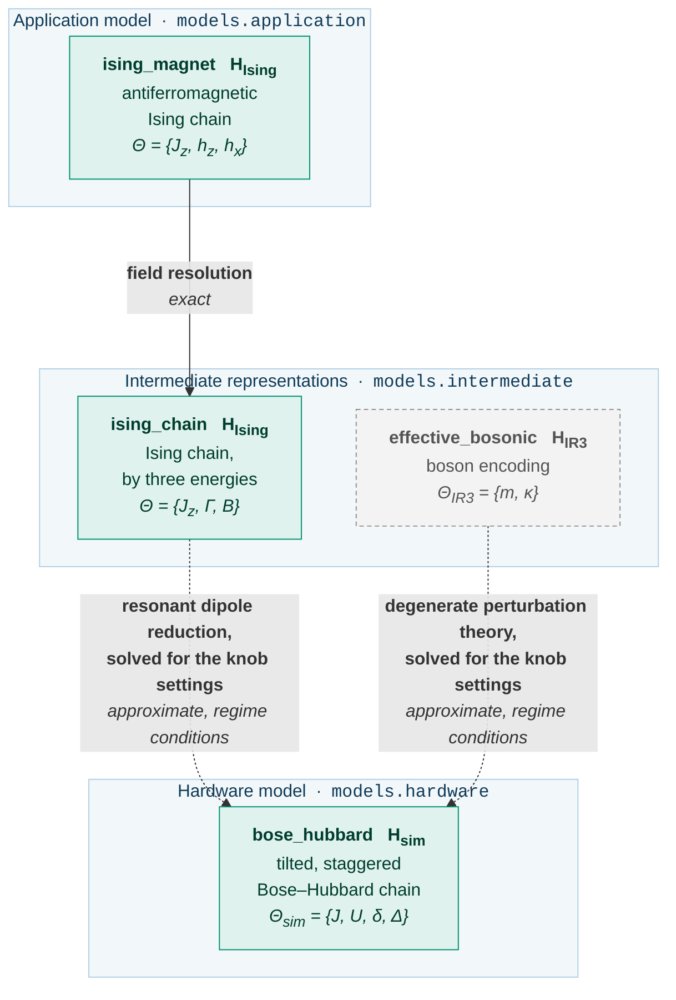

# Guide: the Ising chain on a shared hardware model

[`qsimod.usecases.ising`][qsimod.usecases.ising] carries an antiferromagnetic Ising chain,
`ising_magnet`, to `bose_hubbard`, the tilted Bose-Hubbard chain of [the Schwinger
pipeline](schwinger.md), with its namespace, parameters and admissible set of knobs.  Two
transformations arrive at `bose_hubbard`, so one knob setting can be judged by both derivations.
This page assumes the machinery the Schwinger guide introduces.

The physics follows Simon et al. [1], building on Sachdev, Sengupta and Girvin [2].

## The model graph

The greyed artifact and arrow are the transformation of the gauge theory into the shared
hardware model.

<!-- Generated by scripts/figures.py from the graph this use case builds; do not edit by hand. -->



```python
from qsimod.usecases.ising import DEVICE_TARGET, shared_graph

graph = shared_graph(3)
for edge in graph.incoming(DEVICE_TARGET):
    print(edge)
```

## The transformations at a glance

| Transformation | From | To | Exactness | Kind of approximation | Relation, forward | Relation, inverse |
|---|---|---|---|---|---|---|
| [field resolution][qsimod.transformations.reparametrisations.field_resolution] | `ising_magnet` | `ising_chain` | `EXACT` | — | `CLOSED_FORM` | `CLOSED_FORM` |
| [dipole reduction][qsimod.transformations.perturbative.dipole_reduction] | `ising_chain` | `bose_hubbard` | `APPROXIMATE` | regime conditions | `CLOSED_FORM` | three equations, four knobs |

## `ising_magnet`: the Ising magnet

**Use case:** [`magnet`][qsimod.usecases.ising.magnet] &nbsp;·&nbsp; **library:** [`ising_magnet`][qsimod.models.application.ising_magnet]

$$
\hat H_\text{Ising} = J_z \sum_j \left( \hat S^z_j \hat S^z_{j+1} - h_z \hat S^z_j - h_x \hat S^x_j \right)
$$

One energy $J_z$ and two dimensionless fields $h_z$ and $h_x$; the mapping to the hardware model
holds near the multicritical point $(h_z, h_x) = (1, 0)$.  The structural type declares no
symmetry, since the transverse field does not conserve the total magnetisation.  An XXZ chain
has the same geometry, algebra and lattice, so the conservation law is what distinguishes the
two structural patterns, and the dipole reduction rejects the XXZ chain on this ground:

```python
from qsimod.structure import StructureTypeError
from qsimod.usecases.heisenberg import spin_chain
from qsimod.usecases.ising import dipoles, magnet

print(magnet(3).structure.symmetries or "none declared")
try:
    dipoles().apply(spin_chain(4))  # an XXZ chain: same shape, wrong physics
except StructureTypeError as error:
    print(error)
```

## `ising_magnet` -> `ising_chain`: the field resolution

$$
J_z \to J_z, \qquad \Gamma = h_x J_z, \qquad B = h_z J_z
$$

**Exactness:** `EXACT` and invertible; the same kind of reparametrisation as the [anisotropy
resolution](heisenberg.md#xxz_magnet-xxz_chain-the-anisotropy-resolution) of the magnet, built
by the same helper.

## `ising_chain`: the Ising chain by three energies

**Use case:** [`ising_chain`][qsimod.usecases.ising.ising_chain] &nbsp;·&nbsp; **library:** [`ising_spin_chain`][qsimod.models.intermediate.ising_spin_chain]

$$
\hat H_\text{Ising} = J_z \sum_j \hat S^z_j \hat S^z_{j+1} - \Gamma \sum_j \hat S^x_j - B \sum_j \hat S^z_j
$$

## `ising_chain` -> `bose_hubbard`: the resonant dipole reduction

$$
J_z = U, \qquad \Gamma = 2\sqrt 2\, J, \qquad B = J_z - (\Delta - U)
$$

A Mott insulator at unit filling is tilted so that the tilt per site cancels the interaction:
an atom may move onto its neighbouring site unless that neighbour has moved first.  A moved
atom is a dipole on a bond, the mutual exclusion of adjacent dipoles is the Ising coupling, and
the tunnelling that creates a dipole is the transverse field.  The spins live on the bonds, so
$2N-1$ lattice sites carry $2N-2$ spins, which the transformation declares as its
[`target_sites`][qsimod.transform.Transformation.target_sites]:

```python
from qsimod.usecases.ising import dipoles, fields

print(dipoles().target_sites(4), fields().target_sites(4))  # 3 4
```

**Exactness:** `APPROXIMATE`.  The transverse field is of first order in the tunnelling, since
the process is resonant; the leading error is of second order in $J/U$ and stems from the
off-resonant configurations, three atoms on a site and dipoles on adjacent bonds.

**Validity conditions.**  One domain and four regime conditions:

| Condition | Severity | Quantity | Threshold |
|---|---|---|---|
| `pole: U != 0` | domain | `abs(U)/J` | 1e-3 |
| `J << U` | regime | `J/U` | 0.1 |
| `abs(Delta - U) << Jz` | regime | `abs((Delta-U)/Jz)` | 0.1 |
| `Gamma << Jz` | regime | `abs(Gamma/Jz)` | 0.1 |
| `delta << Gamma` | regime | `delta/Gamma` | 0.1 |

The superlattice $\delta$ acts as a staggered longitudinal field on the spins and must be small
on the scale of the transverse field.

```python
from qsimod.usecases.ising import ParameterNames as P
from qsimod.usecases.ising import coupling_map, dipoles, transverse_map, validity

step = dipoles()
print(step.forward_relation_kind)  # CLOSED_FORM
knobs = {P.TUNNELLING: 0.0177, P.INTERACTION: 1.0, P.SUPERLATTICE: 0.0025, P.TILT: 1.033}
print(
    round(coupling_map().evaluate_real(knobs), 4), round(transverse_map().evaluate_real(knobs), 4)
)
print(
    validity().report(
        {**knobs, P.COUPLING_ISING_CHAIN: 1.0, P.TRANSVERSE: 0.05, P.LONGITUDINAL: 0.967}
    )
)
```

**Convention and boundary term.**  The constraint that forbids two dipoles on adjacent bonds is
represented as a finite penalty, which the source gives as "of order $U$"; the package takes it
equal to $U$, and the quoted $(h_z, h_x)$ values do not depend on this choice.  Rewriting the
penalty as a coupling plus a uniform field is exact in the bulk only: the two end spins see a
field that is short by half a coupling each, the same identity as in [the superexchange of the
magnet](heisenberg.md#what-the-superexchange-also-produces).
[`dipole_boundary_field`][qsimod.transformations.perturbative.dipole_boundary_field] gives its
strength and [`end_magnetisation_term`][qsimod.models.magnetism.end_magnetisation_term] builds
the term; `manifold_check` in `examples/simon2011.py` shows the spectrum agreeing with it and
deviating without it.

## The hardware model, read twice

`bose_hubbard` is unchanged: the same builder, knobs and Hamiltonian.  The two theories need
different corners of its admissible set and pose their requests against different boxes:

```python
from qsimod.parameters import ConstraintOrigin
from qsimod.usecases import ising, schwinger

box = schwinger.device_limits()
for constraint in box.constraints:
    print(constraint)
print(len(box.constraints_from(ConstraintOrigin.APPARATUS)), "of them are the apparatus")
print(len(ising.device_limits().constraints), "left once a second theory poses its request")
```

Every coupled constraint declares an [origin][qsimod.parameters.ConstraintOrigin].  The two
coupled constraints of the Schwinger box have the origin `DERIVATION`: they are requirements of
the superlattice derivation, not of the apparatus, and at the dipole resonance $\Delta \approx U$ one
of them cannot hold.  The Ising use case therefore poses its request against
[`apparatus_only`][qsimod.parameters.AdmissibleSet.apparatus_only] and leaves the validity
conditions to each derivation.

## What a shared hardware model lets the framework decide

One knob setting is judged by both derivations:

```python
from qsimod.usecases import ising, schwinger

knobs = {
    "bose_hubbard.J": 0.0177,
    "bose_hubbard.U": 1.0,
    "bose_hubbard.delta": 0.0025,
    "bose_hubbard.Delta": 1.033,
}
coupling = ising.coupling_map().evaluate_real(knobs)
ising_report = ising.validity().report(
    {
        **knobs,
        "ising_chain.Jz": coupling,
        "ising_chain.Gamma": ising.transverse_map().evaluate_real(knobs),
        "ising_chain.B": ising.longitudinal_map().evaluate_real(
            {**knobs, "ising_chain.Jz": coupling}
        ),
    }
)
gauge_report = schwinger.validity().report(
    {
        **knobs,
        "effective_bosonic.m": schwinger.mass_map().evaluate_real(knobs),
        "effective_bosonic.kappa": schwinger.coupling_map().evaluate_real(knobs),
    }
)
print("Ising:", ising_report.is_valid, round(ising_report.weakest_margin, 2))
print("gauge:", gauge_report.is_valid, round(gauge_report.weakest_margin, 2))
```

The superlattice derivation requires $\Delta \ll \delta$, the dipole derivation $\delta \ll \Gamma$.
The two declared regimes are disjoint: no setting of this lattice realises both theories, and
the margins report this before any operator is built.

## References

1. J. Simon, W. S. Bakr, R. Ma, M. E. Tai, P. M. Preiss and M. Greiner, *Quantum simulation of
   antiferromagnetic spin chains in an optical lattice*, Nature **472**, 307-312 (2011).
   [doi:10.1038/nature09994](https://doi.org/10.1038/nature09994)
2. S. Sachdev, K. Sengupta and S. M. Girvin, *Mott insulators in strong electric fields*,
   Phys. Rev. B **66**, 075128 (2002).
   [doi:10.1103/PhysRevB.66.075128](https://doi.org/10.1103/PhysRevB.66.075128)
