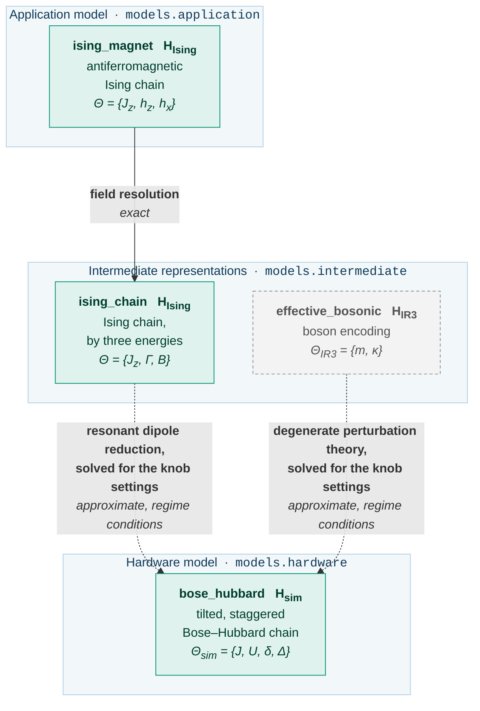

# Guide: the Ising chain on a shared hardware model

The use case [`qsimod.usecases.ising`][qsimod.usecases.ising] carries an antiferromagnetic
Ising chain, the application model `ising_magnet`, to `bose_hubbard`, the tilted Bose-Hubbard chain of [the
Schwinger pipeline](schwinger.md), with its namespace, parameters and admissible set of knobs.
This page assumes the machinery that guide introduces and states what differs.  Two
transformations arrive at `bose_hubbard`, so one knob setting can be judged by both derivations.

The physics follows Simon et al., *Quantum simulation of antiferromagnetic spin chains in an
optical lattice*, Nature **472**, 307-312 (2011), following Sachdev, Sengupta and Girvin.

## The model graph

The greyed artifact and arrow are the transformation of the gauge theory into the shared
hardware model.

<!-- Generated by scripts/figures.py from the graph this use case builds; do not edit by hand. -->



```python
from qsimod.usecases.ising import DEVICE_TARGET, shared_graph

graph = shared_graph(3)
for edge in graph.incoming(DEVICE_TARGET):
    print(edge)
```

## The transformations at a glance

| Transformation | From | To | Exactness | Kind of approximation | Relation, forward direction | Relation, inverse direction |
|---|---|---|---|---|---|---|
| [field resolution][qsimod.transformations.reparametrisations.field_resolution] | `ising_magnet` | `ising_chain` | `EXACT` | — | `CLOSED_FORM` | `CLOSED_FORM` |
| [dipole reduction][qsimod.transformations.perturbative.dipole_reduction] | `ising_chain` | `bose_hubbard` | `APPROXIMATE` | regime conditions | `CLOSED_FORM` | three equations, four knobs |

## `ising_magnet`: the Ising magnet

**Use case:** [`magnet`][qsimod.usecases.ising.magnet] &nbsp;·&nbsp; **library:** [`ising_magnet`][qsimod.models.application.ising_magnet]

```
H_Ising = Jz sum_j ( S^z_j S^z_{j+1} - hz S^z_j - hx S^x_j )
```

The model has one energy `Jz` and two dimensionless fields `hz` and `hx` (`paper_simon11`).
Its phase diagram is drawn on the `(hz, hx)` plane, with an antiferromagnet near the origin
and a paramagnet at large fields.  The mapping to the hardware model holds near the
multicritical point `(1, 0)`.

The structural type declares no symmetry, since the transverse field does not conserve the
total magnetisation.  An XXZ chain has the same geometry, algebra and lattice, so the
conservation law is the aspect by which a structural pattern distinguishes the two; the dipole
reduction rejects the XXZ chain on this ground:

```python
from qsimod.structure import StructureTypeError
from qsimod.usecases.heisenberg import spin_chain
from qsimod.usecases.ising import dipoles, magnet

print(magnet(3).structure.symmetries or "none declared")
try:
    dipoles().apply(spin_chain(4))  # an XXZ chain: same shape, wrong physics
except StructureTypeError as error:
    print(error)
```

## `ising_magnet` -> `ising_chain`: the field resolution

```
Jz    -> Jz             Gamma = hx * Jz             B = hz * Jz
```

**Exactness:** `EXACT` and invertible.  The transformation is the same reparametrisation as
the [anisotropy resolution](heisenberg.md#xxz_magnet-xxz_chain-the-anisotropy-resolution) of the magnet,
built by the same helper from the shared energy scale and one `(dimensionless parameter,
energy)` pair per field.

## `ising_chain`: the Ising chain by three energies

**Use case:** [`ising_chain`][qsimod.usecases.ising.ising_chain] &nbsp;·&nbsp; **library:** [`ising_spin_chain`][qsimod.models.intermediate.ising_spin_chain]

```
H_Ising = Jz sum_j S^z_j S^z_{j+1} - Gamma sum_j S^x_j - B sum_j S^z_j
```

This is the Hamiltonian of `ising_magnet` with `Gamma = Jz hx` and `B = Jz hz`.

## `ising_chain` -> `bose_hubbard`: the resonant dipole reduction

```
Jz    = U
Gamma = 2 sqrt(2) J
B     = Jz - (Delta - U)
```

A Mott insulator at unit filling is tilted so that the tilt per site cancels the interaction:
an atom may move onto its neighbouring site unless that neighbour has moved first.  A moved
atom is a dipole on a bond, the mutual exclusion of adjacent dipoles is the Ising coupling, and
the tunnelling that creates a dipole is the transverse field.

The spins live on the bonds, so `2N-1` lattice sites carry `2N-2` spins.  The transformation
declares this register size as its
[`target_sites`][qsimod.transform.Transformation.target_sites]:

```python
from qsimod.usecases.ising import dipoles, fields

print(dipoles().target_sites(4), fields().target_sites(4))  # 3 4
```

**Exactness:** `APPROXIMATE`, valid within a declared regime.  The transverse field is of first
order in the tunnelling, since the process is resonant, not of second order; the leading error
is of second order in `J/U` and stems from the off-resonant configurations, three atoms on a
site and dipoles on adjacent bonds.

**Validity conditions.**  One domain and four regime conditions:

| Condition | Severity | Quantity | Threshold |
|---|---|---|---|
| `pole: U != 0` | domain | `abs(U)/J` | 1e-3 |
| `J << U` | regime | `J/U` | 0.1 |
| `abs(Delta - U) << Jz` | regime | `abs((Delta-U)/Jz)` | 0.1 |
| `Gamma << Jz` | regime | `abs(Gamma/Jz)` | 0.1 |
| `delta << Gamma` | regime | `delta/Gamma` | 0.1 |

The superlattice `delta` acts as a staggered longitudinal field on the spins and must be small
on the scale of the transverse field.

```python
from qsimod.usecases.ising import ParameterNames as P
from qsimod.usecases.ising import coupling_map, dipoles, transverse_map, validity

step = dipoles()
print(step.forward_relation_kind)  # CLOSED_FORM
knobs = {P.TUNNELLING: 0.0177, P.INTERACTION: 1.0, P.SUPERLATTICE: 0.0025, P.TILT: 1.033}
print(
    round(coupling_map().evaluate_real(knobs), 4), round(transverse_map().evaluate_real(knobs), 4)
)
print(
    validity().report(
        {**knobs, P.COUPLING_ISING_CHAIN: 1.0, P.TRANSVERSE: 0.05, P.LONGITUDINAL: 0.967}
    )
)
```

### One convention, and one term that is not small

**Convention.**  Two dipoles on adjacent bonds are off resonance by the interaction; the
constraint that forbids them is represented as a finite penalty, which the source gives as "of
order `U`".  The package takes it equal to `U`.  Both fields are divided by the coupling, so
the quoted `(hz, hx)` values do not depend on this choice.

**Boundary term.**  Rewriting the penalty as a coupling plus a uniform field is exact in the
bulk only: since `sum_j z_j S^z_j = 2 sum_j S^z_j - (S^z_0 + S^z_{N-1})`, the two end spins
see a field that is short by half a coupling each.
[`end_magnetisation_term`][qsimod.models.magnetism.end_magnetisation_term] builds the term and
[`dipole_boundary_field`][qsimod.transformations.perturbative.dipole_boundary_field] gives its
strength; the identity is the same as in [the superexchange of the
magnet](heisenberg.md#what-the-superexchange-also-produces).  The field amounts to half the
coupling where the transverse field is a fiftieth of it.  `examples/shared_device.py` measures
both: the spectrum agrees to `0.01` transverse fields with the term and deviates by `10` without
it.

## The hardware model, read twice

`bose_hubbard` is unchanged: the same builder, the same four knobs and the same Hamiltonian.  The two
theories need different corners of its admissible set and pose their requests against
different boxes:

```python
from qsimod.parameters import ConstraintOrigin
from qsimod.usecases import ising, schwinger

box = schwinger.device_limits()
for constraint in box.constraints:
    print(constraint)
print(len(box.constraints_from(ConstraintOrigin.APPARATUS)), "of them are the apparatus")
print(len(ising.device_limits().constraints), "left once a second theory poses its request")
```

Every coupled constraint declares an [origin][qsimod.parameters.ConstraintOrigin].  The two
coupled constraints of the Schwinger box have the origin `DERIVATION`: they are requirements of
the superlattice derivation, not of the apparatus.  At the dipole resonance `Delta ~= U` the
second of them reads `delta <= -U`, so the Ising use case poses its request against
[`apparatus_only`][qsimod.parameters.AdmissibleSet.apparatus_only] and leaves the validity
conditions to each derivation.

## What a shared hardware model lets the framework decide

One knob setting is judged by both derivations:

```python
from qsimod.usecases import ising, schwinger

knobs = {
    "bose_hubbard.J": 0.0177,
    "bose_hubbard.U": 1.0,
    "bose_hubbard.delta": 0.0025,
    "bose_hubbard.Delta": 1.033,
}
coupling = ising.coupling_map().evaluate_real(knobs)
ising_report = ising.validity().report(
    {
        **knobs,
        "ising_chain.Jz": coupling,
        "ising_chain.Gamma": ising.transverse_map().evaluate_real(knobs),
        "ising_chain.B": ising.longitudinal_map().evaluate_real(
            {**knobs, "ising_chain.Jz": coupling}
        ),
    }
)
gauge_report = schwinger.validity().report(
    {
        **knobs,
        "effective_bosonic.m": schwinger.mass_map().evaluate_real(knobs),
        "effective_bosonic.kappa": schwinger.coupling_map().evaluate_real(knobs),
    }
)
print("Ising:", ising_report.is_valid, round(ising_report.weakest_margin, 2))
print("gauge:", gauge_report.is_valid, round(gauge_report.weakest_margin, 2))
```

The superlattice derivation requires `Delta << delta`, the dipole derivation `delta << Gamma`.
The two declared regimes are disjoint: no setting of this lattice realises both theories, and
the margins report this before any operator is built.
