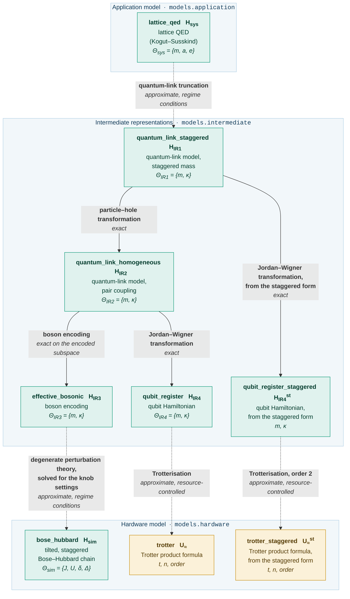

# Guide: the lattice Schwinger model

This page walks through the case study of the accompanying article: a one-dimensional lattice
quantum electrodynamics (QED), the physical system model `H_sys`, is carried through a chain of
intermediate representations to two hardware models of different artifact kinds, an analogue
simulator model `H_sim` (a Bose-Hubbard chain, the node `bose_hubbard`) and a digital simulator model
`U_approx` (a Trotter product formula, the node `trotter`), from a shared prefix.  For each artifact
the page gives the Hamiltonian, the structural type and the parameter set; for each
transformation the operator substitution, the exactness, the kind of approximation, the
validity conditions and the parameter relation, followed by the software perspective on the
same step.  The page also introduces the machinery of the framework, namely the attributes of
a transformation, the contents of an artifact, the numerical realisation, the solver and the
extension interface, which the guides to [the Heisenberg magnet](heisenberg.md) and [the Ising
chain](ising.md) assume.

The physics follows Zhou et al., *Thermalization dynamics of a gauge theory on a quantum
simulator*, Science **377**, 311 (2022) (`paper_zhou22`), and Yang et al., *Observation of gauge
invariance in a 71-site Bose-Hubbard quantum simulator*, Nature **587**, 392 (2020)
(`paper_yang20`).

## The model graph

The use case [`qsimod.usecases.schwinger`][qsimod.usecases.schwinger] assembles artifacts from
the model library [`qsimod.models`][qsimod.models] and transformations from the transformation
library [`qsimod.transformations`][qsimod.transformations] into a model graph.  The figure
shows this graph, including the second digital branch (`qubit_register_staggered`, `trotter_staggered`) that the
[overview figure](index.md) omits.  A solid arrow is an exact transformation and a dotted arrow
an approximate one, with the kind of approximation named underneath.

<!-- Generated by scripts/figures.py from the graph this use case builds; do not edit by hand. -->



The artifact names of the package and the notation of the article correspond as follows.

| Node | Article | Artifact | Parameter set |
|---|---|---|---|
| `lattice_qed` | `H_sys` | physical system model: lattice QED in the Kogut-Susskind formulation | `Theta_sys = {m, a, e}` |
| `quantum_link_staggered` | `H_IR1` | quantum-link model with staggered mass | `Theta_IR1 = {m, kappa}` |
| `quantum_link_homogeneous` | `H_IR2` | quantum-link model after the particle-hole transformation; the branch point | `Theta_IR2 = {m, kappa}` |
| `effective_bosonic` | `H_IR3` | boson encoding of `H_IR2` | `Theta_IR3 = {m, kappa}` |
| `bose_hubbard` | `H_sim` | analogue simulator model: tilted, staggered Bose-Hubbard chain | `Theta_sim = {J, U, delta, Delta}` |
| `qubit_register` | `H_IR4` | qubit Hamiltonian, the Jordan-Wigner image of `H_IR2` | `Theta_IR4 = {m, kappa}` |
| `trotter` | `U_approx` | digital simulator model: Trotter product formula of `H_IR4` | `t`, `n`, order, and `m`, `kappa` |
| `qubit_register_staggered`, `trotter_staggered` | | the second digital branch, leaving `quantum_link_staggered`; see [the two branch points](#the-two-branch-points) | |

The digital branch may leave from `quantum_link_homogeneous` or from `quantum_link_staggered`.

## Library and use case

The model library is indexed by abstraction layer, the transformation library by the kind of
operation a transformation performs.

| Module | Layer | Contents |
|---|---|---|
| [`models.application`][qsimod.models.application] | application | physical system models, stated in the terms of the physical theory |
| [`models.intermediate`][qsimod.models.intermediate] | intermediate representations | forms influenced by the theory and by the hardware |
| [`models.hardware`][qsimod.models.hardware] | hardware | the Hamiltonians that simulators realise natively, with the admissible sets of their knobs |
| [`models.gauge`][qsimod.models.gauge] | shared | generators, sectors and occupation subspaces of the gauge models |
| [`models.magnetism`][qsimod.models.magnetism] | shared | layouts, terms and manifolds of the magnetism models |

| Module | Operation | Exactness |
|---|---|---|
| [`truncations`][qsimod.transformations.truncations] | an infinite-dimensional degree of freedom is made finite | approximate, regime conditions |
| [`basis_changes`][qsimod.transformations.basis_changes] | the Hamiltonian is rewritten in different operators | exact |
| [`encodings`][qsimod.transformations.encodings] | the Hamiltonian is rewritten in a different algebra | exact on the encoded subspace |
| [`reparametrisations`][qsimod.transformations.reparametrisations] | the model is restated in different parameters | exact |
| [`perturbative`][qsimod.transformations.perturbative] | the knobs of a hardware model are related to an effective theory | approximate, regime conditions |
| [`trotterisation`][qsimod.transformations.trotterisation] | a Hamiltonian is replaced by a product of unitaries | approximate, resource-controlled |

A model builder takes a chain length and a parameter [`Namespace`][qsimod.parameters.Namespace];
a transformation builder takes the two namespaces it relates.  `quantum_link_staggered` and `quantum_link_homogeneous` are two calls of
[`quantum_link_model`][qsimod.models.intermediate.quantum_link_model] at two conventions.  Every
artifact and every transformation declares its
[`AbstractionLevel`][qsimod.levels.AbstractionLevel]:

```python
from qsimod.usecases.schwinger import build_graph

for node, level in build_graph(3).levels().items():
    print(f"{node:8} {level}")
```

## The artifacts at a glance

`N` matter sites occupy `2N - 1` interleaved register positions: matter site `l` is at index
`2l` and the gauge link `(l, l+1)` at index `2l + 1`.  The dimensions are given for `N = 3` and
`N = 4`, with the bosonic cutoff `n_max = 2` that the boson encoding requires.

| Node | Artifact kind | Matter | Gauge | Parameters | Terms | Dimension (N=3 / N=4) |
|---|---|---|---|---|---|---|
| `lattice_qed` | Hamiltonian | fermion | untruncated U(1) link | `m`, `a`, `e`, `electric_gap` | 9 | **not realisable** |
| `quantum_link_staggered` | Hamiltonian | fermion | spin-1/2 | `m`, `kappa` | 7 | 32 / 128 |
| `quantum_link_homogeneous` | Hamiltonian | fermion | spin-1/2 | `m`, `kappa` | 8 | 32 / 128 |
| `effective_bosonic` | Hamiltonian | boson | boson | `m`, `kappa` | 8 | 243 / 2187 |
| `bose_hubbard` | Hamiltonian | boson | boson | `J`, `U`, `delta`, `Delta` | 23 | 243 / 2187 |
| `qubit_register` | Hamiltonian | qubit | qubit | `m`, `kappa` | 8 | 32 / 128 |
| `qubit_register_staggered` | Hamiltonian | qubit | qubit | `m`, `kappa` | 7 | 32 / 128 |
| `trotter` | **product formula** | qubit | qubit | `t`, `n`, `2k` (and `m`, `kappa`) | — | 32 / 128 |
| `trotter_staggered` | **product formula** | qubit | qubit | `t`, `n`, `2k` (and `m`, `kappa`) | — | 32 / 128 |

| Abstraction layer | Nodes |
|---|---|
| application: the physical system model in its own terms | `lattice_qed` |
| intermediate representations | `quantum_link_staggered`, `quantum_link_homogeneous`, `effective_bosonic`, `qubit_register`, `qubit_register_staggered` |
| hardware: the Hamiltonian or product formula a simulator realises natively | `bose_hubbard` (analogue), `trotter` / `trotter_staggered` (digital) |
| executable: gate set, routing, pulses | **out of scope** |

Parameter names are namespaced by the artifact that owns them (`bose_hubbard.J`, `effective_bosonic.kappa`).  The
library uses the local names of [`qsimod.models.names`][qsimod.models.names]; the fully
qualified names are constants on [`ParameterNames`][qsimod.usecases.schwinger.ParameterNames].

!!! note "`effective_bosonic` and `bose_hubbard` are bosonic"

    `H_IR3` is written in bosonic operators, so its realisation has dimension `3**(2N-1)` at
    `n_max = 2` rather than `2**(2N-1)`; the two-states-per-site subspace is a declaration on
    the artifact, not a property of the allocated array.

## What an artifact carries

Every node is an [`Artifact`][qsimod.artifact.Artifact]: it carries a structural type, a
parameter set and a binding of the parameters.  A
[`HamiltonianModel`][qsimod.artifact.HamiltonianModel] additionally carries the operator and
the declarations listed below.

| Declaration | Content |
|---|---|
| `hamiltonian` | a symbolic sum of operator products |
| `constraint_operators` | the generators of a declared symmetry, here the Gauss operators `G_l`, each with a target eigenvalue |
| `sector` | the superselection sector in which physical states live |
| `local_subspace` | a declared per-site occupation subspace |
| `dropped_constants` | the additive constants discarded by the transformations that produced the artifact, with their values |

The structural type declares only that a symmetry exists, by name, group and locality; this is
what a transformation type-checks against.  The operator form of the generators is data on the
model.

## The transformations at a glance

| Transformation | From | To | Exactness | Kind of approximation | Relation, forward direction | Relation, inverse direction |
|---|---|---|---|---|---|---|
| [quantum-link truncation][qsimod.transformations.truncations.quantum_link_truncation] | `lattice_qed` | `quantum_link_staggered` | `APPROXIMATE` | regime conditions | `CLOSED_FORM` | `CLOSED_FORM` |
| [particle-hole transformation][qsimod.transformations.basis_changes.particle_hole_transformation] | `quantum_link_staggered` | `quantum_link_homogeneous` | `EXACT` | — | `CLOSED_FORM` | `CLOSED_FORM` |
| [boson encoding][qsimod.transformations.encodings.hardcore_boson_encoding] | `quantum_link_homogeneous` | `effective_bosonic` | `EXACT` on the encoded subspace | — | `CLOSED_FORM` | `CLOSED_FORM` |
| [second-order perturbation theory][qsimod.transformations.perturbative.second_order_perturbation_theory] | `effective_bosonic` | `bose_hubbard` | `APPROXIMATE` | regime conditions | `CLOSED_FORM` | **`UNDER_DETERMINED`** |
| [Jordan-Wigner transformation][qsimod.transformations.basis_changes.jordan_wigner_to_qubits] | `quantum_link_homogeneous` | `qubit_register` | `EXACT` | — | `CLOSED_FORM` | `CLOSED_FORM` |
| [Jordan-Wigner transformation from `quantum_link_staggered`][qsimod.transformations.basis_changes.jordan_wigner_to_qubits] | `quantum_link_staggered` | `qubit_register_staggered` | `EXACT` | — | `CLOSED_FORM` | `CLOSED_FORM` |
| [Trotterisation][qsimod.transformations.trotterisation.suzuki_trotter] | `qubit_register` | `trotter` | `APPROXIMATE` | **resource-controlled** | `CLOSED_FORM` | `CLOSED_FORM` |

The parameter relation of the perturbative step is derived from the hardware model to
the effective theory: in this forward direction it is a closed form from the knobs to the effective
parameters, in the inverse direction, the solve for the knob settings, it is under-determined.
Both classifications are computed from one relation object.

## The attributes of a transformation

A [`Transformation`][qsimod.transform.Transformation] is a declaration before it is a
computation.  It carries three independent attributes that are checked when it is applied.

| Attribute | Fields | Question decided |
|---|---|---|
| **structural type and artifact kind** | `source_pattern`, `source_kind` | May this transformation be applied to this artifact? |
| **exactness** | `exactness` | Is the operator form of the target unitarily equivalent to that of the source?  An `EXACT` transformation is checked on every application: the source Hamiltonian is rewritten in the operators of the target ([`image`][qsimod.transform.Transformation.image]) and compared, in [normal form][qsimod.normal_form], with the target model; a mismatch raises [`ExactnessError`][qsimod.transform.ExactnessError]. |
| **kind of approximation** | `approximation.kind` | Is the error bounded by regime conditions on the parameters, or controlled by a resource parameter? |

Whether the hardware can be tuned to the coefficients the operator form demands is a property
of the parameter relation and is resolved by [the solving layer][qsimod.solving]; see [posing a
solve](#posing-a-solve).

## Reading a transformation

```python
from qsimod.usecases.schwinger import perturbation

step = perturbation()
print(step)  # name, exactness, approximation kind
print(step.relation)  # the equations
print(step.validity)  # the condition names
print(step.forward_relation_kind)  # CLOSED_FORM
print(step.inverse_relation_kind)  # UNDER_DETERMINED
print(step.source_pattern)  # what it demands
print(step.target_pattern)  # what it guarantees
```

## `H_sys` (`lattice_qed`): the physical system model

**Use case:** [`theory`][qsimod.usecases.schwinger.theory] &nbsp;·&nbsp; **library:** [`kogut_susskind_gauge_theory`][qsimod.models.application.kogut_susskind_gauge_theory]

```
H_QED = (a/2) sum_l E^2_{l,l+1}
      + m sum_l (-1)^l psi^dag_l psi_l
      - (i/2a) sum_l ( psi^dag_l U_{l,l+1} psi_{l+1} - h.c. )
```

Matter, that is staggered spinless fermions `psi_l`, lives on the `N` sites of a
one-dimensional lattice with spacing `a`; on the links between the sites live the electric field
`E_{l,l+1}` and the compact U(1) link operator `U_{l,l+1}` that shifts it by one unit.  The
three sums are the energy of the electric field, the rest energy of the particles with mass `m`,
and the hopping of a particle across a link, which changes the field on that link.  The
alternating sign of the mass term is the staggered encoding of the fermions, which places
particles on even and antiparticles on odd sites.  Gauss's law states that at every site the
difference of the electric field on the two adjacent links equals the charge at that site; its
generators carry the gauge coupling `e` on the charge,

```
G_l = E_{l,l+1} - E_{l-1,l} - e [ n_l - (1 - (-1)^l)/2 ]
```

with target `G_l = 0` in the bulk.  On an open chain the boundary generators omit one link,
take half-integer values and are never zero; their declared targets are `-1/2` at `l = 0` and
`(-1)**N / 2` at `l = N-1`, the particle-hole image of the homogeneous sector.

**Software perspective.**  Gauss's law is a local symmetry, which the artifact records
alongside the Hamiltonian: the generators and the sector in which physical states live are
data on the model.  The parameter set is `Theta_sys = {m, a, e}`; a fourth parameter,
`electric_gap`, is used by no term and carries the energy cost `a e**2 / 2` of one extra unit of
electric flux, against which the validity condition of the quantum-link truncation is
evaluated.  The
structural type declares the matter sites as fermionic two-level systems and the electric
field of a link as an infinite-dimensional degree of freedom with the algebra
[`Algebra.GAUGE_LINK_U1`][qsimod.structure.Algebra] and `local_dimension = None`.  The artifact
therefore has no finite matrix representation:

```python
from qsimod.realise import HilbertSpace
from qsimod.usecases.schwinger import theory

try:
    HilbertSpace.of(theory(3).structure)
except ValueError as error:
    print(error)
# cannot realise H_QED: degree(s) of freedom ['gauge'] have no finite-dimensional
# representation
```

The type nevertheless allows the transformations that follow to be type-checked without an
explicit matrix representation.

## `lattice_qed` -> `quantum_link_staggered`: the quantum-link truncation

The infinitely many field values of a link are cut down to the two lowest, which leaves a
spin-1/2 on each link.  The three spin operators replace the electric field and the link
operator, uniformly in `l`:

```
U_{l,l+1} -> (2/sqrt(3)) S^+_{l,l+1}       E_{l,l+1} -> e S^z_{l,l+1}
```

in units of `e = 1`, `a = 1`.  The factor `-i` of the coupling of `H_sys` is absorbed into the
phase of the link operator, `U -> -i (2/sqrt(3)) S^+`, which gives the real form
`(kappa/2)(... + h.c.)`.

**Exactness:** `APPROXIMATE`, valid within a declared regime.  The truncation is faithful only
if the dynamics does not populate the discarded field values, which is the case if the coupling
is small against the energy gap to the first discarded value.  No resource parameter reduces
the error.

**Validity conditions:**

| Condition | Severity | Quantity | Threshold |
|---|---|---|---|
| `field sector within truncation` | regime | `kappa/(a e^2/2)` | **1.0** |

The threshold is 1.0 rather than the default 0.1 of the package: the coupling must not exceed
the cost of one unit of electric flux.

**Discarded constant.**  Since `S^z` squared is `1/4`, the electric energy becomes the additive
constant `(a/2) sum_l E^2 -> (N-1) a e^2 / 8` (`(N-1)/8` at `a = e = 1`).  It is dropped from
the Hamiltonian and recorded on the target artifact together with its value:

```python
from qsimod.usecases.schwinger import ParameterNames as P
from qsimod.usecases.schwinger import theory, truncation

bound = theory(3).bind(
    **{P.MASS_LATTICE_QED: 0.0, P.LATTICE_SPACING: 1.0, P.GAUGE_COUPLING: 1.0, P.ELECTRIC_GAP: 0.5}
)
truncated = truncation().apply(bound)
print(truncated.dropped_constants[0])  # (a/2) sum_l E^2 -> (N-1) a e^2 / 8 = 0.25
```

Every other additive constant in the package is retained; see [discarded
constants](#discarded-constants).

**Parameter relation.**  Taken literally, the substitution fixes the coupling at `2/sqrt(3)`.
From `quantum_link_staggered` on, `kappa` is instead released as the tunable coupling of the simulated theory, so
the relation carries only the mass:

```
mass carried over: quantum_link_staggered.m = lattice_qed.m
```

One equation for two target parameters: the composite pipeline has two residual degrees of
freedom.

**Software perspective.**  In the structural type of the target only the algebra of the links
changes, from the infinite-dimensional link to a spin-1/2.  The matter and the local symmetry
remain, with the generators of Gauss's law rewritten in the new operators, and the parameter
set becomes `Theta_IR1 = {m, kappa}`.

## `H_IR1` (`quantum_link_staggered`): the quantum-link model with staggered mass

**Use case:** [`staggered_quantum_link`][qsimod.usecases.schwinger.staggered_quantum_link] &nbsp;·&nbsp; **library:** [`quantum_link_model`][qsimod.models.intermediate.quantum_link_model] at [`STAGGERED_CONVENTION`][qsimod.models.intermediate.STAGGERED_CONVENTION]

```
H_QLM^st = sum_l [ (kappa/2)( psi^dag_l S^+_{l,l+1} psi_{l+1} + h.c. )
                 + m (-1)^l psi^dag_l psi_l ]
```

This is Eq. (S1) of `paper_zhou22`: a hopping coupling, a uniform `S^+` and a staggered mass,
with two states per link.  The Gauss operators keep the form of `H_sys` with `E -> S^z` and
`e -> 1`,

```
G_l = S^z_{l,l+1} - S^z_{l-1,l} - [ n_l - (1 - (-1)^l)/2 ]
```

with target zero in the bulk, `-1/2` at `l = 0` and `(-1)**N / 2` at `l = N-1`.

`kappa` is a parameter of this artifact and is bound here, not at `lattice_qed`:

```python
from qsimod.usecases.schwinger import ParameterNames as P
from qsimod.usecases.schwinger import build_graph

graph = build_graph(3)
staggered = graph.graph.node("quantum_link_staggered").bind(
    **{P.MASS_QUANTUM_LINK_STAGGERED: 0.41, P.COUPLING_QUANTUM_LINK_STAGGERED: 0.83}
)
print(staggered.is_fully_bound)  # True
print(staggered.pretty())  # the Hamiltonian, with psi on the fermionic sites
```

## `quantum_link_staggered` -> `quantum_link_homogeneous`: the particle-hole transformation

The particle-hole transformation relabels the basis states.  On every odd matter site the roles
of occupied and empty are exchanged, and on every even link the spin is flipped:

```
on matter sites l = 1, 3, 5, ...  (odd):   n_l -> 1 - n_l,   psi_l -> psi^dag_l
on links (l, l+1) with l = 0, 2, ... (even):  S^z -> -S^z,   S^+- -> S^-+
```

**Exactness:** `EXACT`, a unitary change of variables, and checked on application: the
transformation rewrites `H_QLM^st` under the map above and compares the result with the
library's `H_QLM` in normal form.  The alternating sign of the mass term is removed, and the
hopping term, which moves a particle across a link, becomes a pair term that creates or
annihilates a particle-antiparticle pair on the two sides of a link.  As written, the map gives
the pair coupling an alternating sign `(-1)^(l+1)` on the links; the rotation `S^± -> -S^±` on
the even links, a rotation about `z` that leaves `S^z` and every `G_l` unchanged, removes it.
The uniform-sign form printed under `quantum_link_homogeneous` is this composite.

!!! danger "The two parities must be opposite"

    Flipping every link, or the links of the same parity as the matter sites, produces no
    model of this family.  The two valid combinations differ in the sign of the mass handed to
    `quantum_link_homogeneous`:

    | matter flipped | links flipped | mass at quantum_link_homogeneous |
    |---|---|---|
    | **odd** | **even** | **`+m`**, the convention taken here |
    | even | odd | `-m`, which inverts the phase assignment at large mass |

    Check: the ground state of `H_QLM` at `m = -40` has `<n_matter> = 1.000` and at `m = +40`
    has `<n_matter> = 0.000`.

**Parameter relation:** an identity on both parameters, a closed form in both directions:

```
quantum_link_homogeneous.m = quantum_link_staggered.m
quantum_link_homogeneous.kappa = quantum_link_staggered.kappa
```

**Constant.**  The staggering leaves `- m * floor(N/2)`, which is retained as an identity term.

**Software perspective.**  The transformation is exact; the structural type and the parameter
set `Theta_IR2 = Theta_IR1 = {m, kappa}` of the target are unchanged.

## `H_IR2` (`quantum_link_homogeneous`): the quantum-link model with pair coupling

**Use case:** [`homogeneous_quantum_link`][qsimod.usecases.schwinger.homogeneous_quantum_link] &nbsp;·&nbsp; **library:** [`quantum_link_model`][qsimod.models.intermediate.quantum_link_model] at [`HOMOGENEOUS_CONVENTION`][qsimod.models.intermediate.HOMOGENEOUS_CONVENTION]

```
H_QLM = sum_l [ (kappa/2)( psi_l S^+_{l,l+1} psi_{l+1} + h.c. ) + m psi^dag_l psi_l ]
        - m * floor(N/2)
```

```
G_l = S^z_{l-1,l} + S^z_{l,l+1} + n_l
```

The coupling `psi_l S^+ psi_{l+1}` is a pair creation and annihilation term, not a hopping:
two particles on neighbouring matter sites combine into a doublon on the link between them,
and back.  The total matter charge is not conserved.

The Gauss targets are zero in the bulk and `+1/2` at both ends: `G_0` and `G_{N-1}` omit one
link and take values in `{-1/2, +1/2, +3/2}`.  In the sector so declared the canonical state
has `sum_l <G_l^2> = 0.5` at every `N`.
[`sector_projector`][qsimod.realise.build.sector_projector] builds the projector from the
declared per-operator eigenvalues, boundary included; the naive product `prod_l delta(G_l)`
would annihilate the physical state.

This artifact is the branch point of the case study: the analogue branch continues with the
boson encoding, the digital branch with the Jordan-Wigner transformation.

## Analogue simulation branch

The objective of the analogue branch is a mapping from `H_IR2` to a simulator Hamiltonian
`H_sim` that a neutral-atom quantum simulator realises natively, together with the knob
settings under which the simulator reproduces the theory.

### `quantum_link_homogeneous` -> `effective_bosonic`: the boson encoding

The two-level degrees of freedom of `H_IR2` are expressed by atom numbers: an occupied or
empty matter site by one or zero atoms, an up or down link spin by two or zero atoms.  Matter
site `l` is identified with position `2l` and link `(l,l+1)` with position `2l+1`:

```
sigma^-_l = P_l a_l P_l              S^- = (1/sqrt(2)) P d^2 P
sigma^z_l = P_l (2 a^dag_l a_l - 1) P_l    S^z = (1/2) P (d^dag d - 1) P
```

**Exactness:** `EXACT` on the encoded subspace.  The identities hold as `A = P B P`, in which
every site carries a correctly encoded occupation; outside this subspace, for instance with two
atoms on a matter site or one atom on a link site, the identities fail and `H_IR3` does not
preserve the subspace.  The target artifact declares the allowed occupations per site;
[`sandwich`][qsimod.realise.build.sandwich] produces `P H P`, and
[`subspace_indices`][qsimod.realise.build.subspace_indices] with
[`restrict`][qsimod.realise.build.restrict] extract the `2**(2N-1)`-dimensional block for a
spectral comparison.  At the reference point the spectra agree to `1.7e-16`.

**Software perspective.**  The parameter set `Theta_IR3 = {m, kappa}` is unchanged, while the
structural type declares both degrees of freedom as bosonic, with the occupation subspace
recorded on the artifact so that a numerical realisation can enforce it.

### `H_IR3` (`effective_bosonic`): the effective bosonic model

**Use case:** [`effective_bosonic`][qsimod.usecases.schwinger.effective_bosonic] &nbsp;·&nbsp; **library:** [`bosonic_pair_coupling_model`][qsimod.models.intermediate.bosonic_pair_coupling_model]

```
H_eff = sum_{j even, 0 <= j <= 2N-4} [ (kappa / 2 sqrt(2)) b_j b_{j+2} (b^dag_{j+1})^2 + h.c. ]
      + sum_{j even, 0 <= j <= 2N-2}   m n_j
      - m * floor(N/2)
```

The pair term describes two atoms on neighbouring matter sites that jointly move onto the link
site between them, and back.  The coupling has `N-1` terms, one per link, the mass `N` terms,
one per matter site.  `paper_yang20` prints the coupling in the form above and `paper_zhou22`
(Eq. (S7)) as its Hermitian conjugate; with `+ h.c.` the two are the same operator.

The declared subspace ([`local_occupation_subspace`][qsimod.models.gauge.local_occupation_subspace])
admits `n in {0, 1}` on the even (matter) positions and `n in {0, 2}` on the odd (link)
positions.  Any realisation needs `n_max >= 2`, which
[`LocalSubspace.required_cutoff`][qsimod.artifact.LocalSubspace.required_cutoff] reports.

!!! warning "`H_eff` does not preserve the subspace; `P H_eff P` is the exact operator"

    The Hermitian partner of the coupling raises a matter occupation from one to two.  The
    leakage operator has norm `sqrt(2) * kappa`:

    ```python
    from qsimod.realise import (
        HilbertSpace,
        RealisationRequest,
        build_operator,
        local_subspace_projector,
        spectral_norm,
    )
    from qsimod.usecases.schwinger import ParameterNames as P
    from qsimod.usecases.schwinger import effective_bosonic, local_occupation_subspace

    model = effective_bosonic(3)
    space = HilbertSpace.of(model.structure, RealisationRequest(boson_cutoff=2))
    projector = local_subspace_projector(local_occupation_subspace(3), space)
    operator = build_operator(
        model.hamiltonian,
        space,
        {P.MASS_EFFECTIVE_BOSONIC: 0.41, P.COUPLING_EFFECTIVE_BOSONIC: 0.83},
    )
    complement = space.identity() - projector
    print(spectral_norm(complement @ operator @ projector))  # 1.1738... = sqrt(2) * 0.83
    ```

### `effective_bosonic` -> `bose_hubbard`: finding the knob settings by second-order perturbation theory

The pair tunnelling of `H_IR3` has to be realised by the single-atom tunnelling that the
Bose-Hubbard chain offers.  This is achieved by tuning the hardware to a resonance: the two
configurations the pair term connects, one atom on each of two neighbouring matter sites and
both atoms on the link site between them, have the same energy at `U ~= 2 delta`, whereas the
intermediate configurations with one atom on the link site lie off by `delta ± Delta` and
`U - delta ± Delta`.  A single tunnelling event out of the resonant pair is therefore
suppressed, and a two-step process through an intermediate configuration realises the pair
term.  Degenerate perturbation theory to second order yields the parameters of the effective
theory as functions of the knobs, the forward direction of the derivation:

```
m = delta - U/2

kappa = sqrt(2) J^2 [ 1/(delta+Delta) + 1/(delta-Delta)
                    + 1/(U-delta+Delta) + 1/(U-delta-Delta) ]
```

The mass is the detuning from the resonance, and the coupling is quadratic in the tunnelling
rate `J`, with the four denominators being the energy offsets of the intermediate
configurations.  The tilt `Delta` is required to suppress a competing two-step process that
moves a single atom across two sites and would violate Gauss's law; `Delta = 0` is therefore
not admissible, and the tilt has to stay above the coupling but below the other energy scales.

**Parameter relation.**  Five solved forms for two equations:

| Solved form | Solves | Note |
|---|---|---|
| `effective_bosonic.m := delta - U/2` | mass | |
| `effective_bosonic.kappa := sqrt(2) J^2 (...)` | coupling | |
| `bose_hubbard.delta := m + U/2` | mass | at fixed `U` |
| `bose_hubbard.U := 2(delta - m)` | mass | at fixed `delta` |
| `bose_hubbard.J := sqrt(kappa / (sqrt(2) * pole sum))` | coupling | positive branch, at fixed `(U, delta, Delta)` |

**Validity conditions.**  Four domain conditions exclude the poles of the coupling formula and
six regime conditions ensure the assumptions of the expansion:

| Condition | Severity | Quantity | Threshold | Origin |
|---|---|---|---|---|
| `pole: delta != +Delta` | domain | `abs(delta-Delta)/delta` | 1e-3 | first pole |
| `pole: delta != -Delta` | domain | `abs(delta+Delta)/delta` | 1e-3 | second pole |
| `pole: U-delta != +Delta` | domain | `abs(U-delta-Delta)/U` | 1e-3 | third pole |
| `pole: U-delta != -Delta` | domain | `abs(U-delta+Delta)/U` | 1e-3 | fourth pole |
| `J << delta` | regime | `J/delta` | 0.1 | perturbative expansion parameter |
| `J << U` | regime | `J/U` | 0.1 | perturbative expansion parameter |
| `abs(m) << U  (U ~= 2 delta)` | regime | `abs(m)/U` | 0.1 | near-degeneracy of the manifold |
| `Delta << delta` | regime | `Delta/delta` | 0.1 | the tilt must not disturb the manifold |
| `Delta << U` | regime | `Delta/U` | 0.1 | the tilt must not disturb the manifold |
| `kappa << Delta` | regime | `kappa/Delta` | 0.1 | the tilt must suppress two-site tunnelling |

A regime condition of the form `a << b` is evaluated as the ratio `a/b <= theta` with the
default threshold `theta = 0.1` and recorded with the ratio.  A domain failure is a pole and is
never overridable; a regime failure means that the derivation's assumptions are violated at a
point where the formulas remain defined.  A report gives, per condition, the quantity, its
value, the requirement and the margin in decades of slack; reports print the quantities with
absolute-value bars (`|m|/U`):

```python
from qsimod.usecases.schwinger import ParameterNames as P, validity

report = validity().report(
    {
        P.TUNNELLING: 0.02,
        P.INTERACTION: 1.0,
        P.SUPERLATTICE: 0.52,
        P.TILT: 0.048,
        P.MASS_EFFECTIVE_BOSONIC: 0.02,
        P.COUPLING_EFFECTIVE_BOSONIC: 0.004525,
    }
)
print(report)
print(report.weakest())  # which condition is closest to failing
```

Since `m = delta - U/2`, the resonance condition `U ~= 2 delta` is the regime condition
`|m| << U`.  At `Delta = 0` the ratio `kappa/Delta` is infinite and the condition fails with
margin `-inf`.  The declared regime is two-sided, `kappa << Delta << delta, U`; under the
default objective the solve lands where `Delta << delta` and `kappa << Delta` have equal
margins.

**Leading error.**  Third-order terms cancel in this manifold; the leading correction is of
fourth order in `J`, a relative error scaling like `(J/U)^2` relative to `kappa ~ J^2/U`.

**Software perspective.**  The derivation runs from `Theta_sim` to `Theta_IR3`, whereas the
framework has to find the knob settings that realise a requested theory.  The transformation
therefore poses the forward maps as a solve for `Theta_sim` given `(m, kappa)`, a system of two
equations in four unknowns that is under-determined.  Applying the transformation accordingly
returns the hardware model with its parameters unbound:

```python
from qsimod.usecases.schwinger import ParameterNames as P, build_graph

graph = build_graph(3)
theory = graph.graph.node("lattice_qed").bind(
    **{
        P.MASS_LATTICE_QED: 0.02,
        P.LATTICE_SPACING: 1.0,
        P.GAUGE_COUPLING: 1.0,
        P.ELECTRIC_GAP: 0.5,
    }
)
target = graph.analogue.apply(theory)
print(target)  # bose_hubbard <Hamiltonian> H_BHM [unbound]
print(target.free_parameters)
# ('bose_hubbard.J', 'bose_hubbard.U', 'bose_hubbard.delta', 'bose_hubbard.Delta')
```

A knob setting determined by the solver is valid only if it lies in the admissible set and
inside the declared regime, and the result reports the margin of every validity condition; see
[posing a solve](#posing-a-solve).

### `H_sim` (`bose_hubbard`): the analogue simulator model

**Use case:** [`superlattice`][qsimod.usecases.schwinger.superlattice] &nbsp;·&nbsp; **library:** [`tilted_bose_hubbard_chain`][qsimod.models.hardware.tilted_bose_hubbard_chain]

```
H_BHM = - J sum_{j=0}^{2N-3} ( b^dag_j b_{j+1} + h.c. )
      + sum_{j=0}^{2N-2} [ (U/2) n_j (n_j - 1) + eps_j n_j ],
eps_j = (-1)^j delta/2 + j Delta
```

The Bose-Hubbard model describes a chain of neutral atoms held in an optical superlattice and
addressed by laser controls.  Its knobs are the tunnelling `J` between neighbouring sites, the
on-site interaction `U`, the superlattice depth `delta`, which alternates the site energies
between matter and link positions, and the tilt `Delta`, which adds a linear energy slope
along the chain.  The `2N-1` open-boundary sites carry `2N-2` bonds.

**Software perspective.**  The parameter set `Theta_sim = {J, U, delta, Delta}` consists of
the knobs of the realising hardware, which are set through laser intensities and a field
gradient in practice.  The structural type declares bosonic degrees of freedom with unbounded
occupation.  The admissible set of the knobs
([`device_limits`][qsimod.models.hardware.bose_hubbard_admissible_set]) is attached to the
artifact:

```python
from qsimod.usecases.schwinger import device_limits

print(device_limits())
# optical superlattice simulator: bose_hubbard.J in (0, 0.25]; bose_hubbard.U in [0.05, 4];
#   bose_hubbard.delta in (0, 2.5]; bose_hubbard.Delta in (0, 0.6];
#   tilt within the superlattice depth: (0.5*bose_hubbard.delta - bose_hubbard.Delta) >= 0;
#   tilt within the resonance gap:
#     (0.5*(bose_hubbard.U - bose_hubbard.delta) - bose_hubbard.Delta) >= 0
```

`J = 0` and `Delta = 0` are excluded strictly.  The two coupled constraints keep the tilt at
most half the superlattice depth and half the resonance gap, away from the poles of the
coupling formula.  Constraints are [`Scalar`][qsimod.scalar.Scalar] expressions, which the
solving layer evaluates, differentiates and bounds by interval arithmetic.

!!! warning "The perturbative manifold is not the ground-state manifold"

    On the three-site block `j = 0,1,2`, the configurations `|101>` and `|020>` form a
    near-degenerate manifold when `U ~= 2 delta` and `J << U, delta`, while `|110>` and
    `|011>` lie far off resonance.  This manifold is not the global ground-state manifold of
    `H_BHM`; the declared local subspace encodes which subspace is meant.

## Digital simulation branch

The objective of the digital branch is to express the time evolution under `H_IR2` as
gate-based instructions on qubits.

### `quantum_link_homogeneous` -> `qubit_register`: the Jordan-Wigner transformation

Gate-based hardware operates with qubits, while `H_IR2` contains fermions on the matter sites
and spins on the links.  The spin-1/2 of a link is already a qubit, with `S^z` and `S^±`
becoming the Pauli operators `sigma^z/2` and `sigma^±`.  A fermionic site is a two-level
system as well, but its operators acquire a sign when reordered past other fermions; the
Jordan-Wigner transformation restores these signs by attaching parity operators for all
preceding matter sites to each qubit operator.  Matter sites and links are placed on one
register of `2N - 1` qubits, in the layout of the optical lattice:

```
psi^dag_l psi_l   ->  (sigma^z_{2l} + 1) / 2
psi_l psi_{l+1}   ->  sigma^-_{2l} sigma^-_{2l+2}
S^+-_{l,l+1}      ->  sigma^+-_{2l+1}
S^z_{l,l+1}       ->  sigma^z_{2l+1} / 2
```

**Exactness:** `EXACT`.  The Jordan-Wigner string runs over the matter sites only, and each
coupling term connects adjacent matter sites, so the parity strings collapse to a sign and no
non-local operator survives.  This holds for a one-dimensional nearest-neighbour chain; a
next-nearest-neighbour coupling would leave a string.

The sign convention is the alternating-sign Jordan-Wigner map of
[`qsimod.realise.build`][qsimod.realise.build], which both branches use.  The fermionic
realisation of `quantum_link_homogeneous` and the qubit realisation of `qubit_register` are identical matrices.

**Software perspective.**  The transformation is exact, with the parameter set
`Theta_IR4 = Theta_IR2 = {m, kappa}` of the target unchanged.  The structural type of the
target keeps the geometry of `2N - 1` interleaved positions and the local symmetry, whose
generators are rewritten with Pauli operators, and both degrees of freedom, spin and fermion,
change their algebra to qubits.

#### The two branch points

The particle-hole transformation is needed by the analogue branch, which realises the pair
coupling of `H_IR2` on the optical lattice, but not by the digital one.  The digital branch may
therefore leave from `quantum_link_homogeneous`, by
[`to_qubits`][qsimod.usecases.schwinger.to_qubits], or from `quantum_link_staggered`, by
[`to_qubits_from_staggered`][qsimod.usecases.schwinger.to_qubits_from_staggered], which
applies the same map in the staggered convention; the two qubit Hamiltonians are unitarily
equivalent:

```python
from qsimod.realise import HilbertSpace, build_operator, eigensystem
from qsimod.usecases.schwinger import (
    ParameterNames as P,
    build_graph,
    to_qubits_from_staggered,
    to_qubits,
    particle_hole,
)

staggered = (
    build_graph(4)
    .graph.node("quantum_link_staggered")
    .bind(**{P.MASS_QUANTUM_LINK_STAGGERED: 0.41, P.COUPLING_QUANTUM_LINK_STAGGERED: 0.83})
)
via_homogeneous = to_qubits().apply(particle_hole().apply(staggered))
via_staggered = to_qubits_from_staggered().apply(staggered)
# identical spectra to 1e-10, a numerical check of the two exact transformations
```

`graph.outgoing("quantum_link_staggered")` returns both edges.

### `H_IR4` (`qubit_register`): the qubit Hamiltonian

**Use case:** [`qubit_register`][qsimod.usecases.schwinger.qubit_register] &nbsp;·&nbsp; **library:** [`k_local_qubit_model`][qsimod.models.intermediate.k_local_qubit_model]

```
H_qubit = sum_{l=0}^{N-2} (kappa/2) ( sigma^-_{2l} sigma^+_{2l+1} sigma^-_{2l+2} + h.c. )
        + sum_{l=0}^{N-1} m n_{2l}   - m * floor(N/2)
```

Each coupling term acts on the three qubits `(matter l, link (l,l+1), matter l+1)` and
expands into four products of three Pauli matrices,

```
sigma^-_a sigma^+_b sigma^-_c + h.c. = (1/4)( X_aX_bX_c + X_aY_bY_c - Y_aX_bY_c + Y_aY_bX_c )
```

which mutually commute, so `exp(-i theta * Sigma)` factorises exactly into four three-qubit
rotations.  Every term commutes with every Gauss operator, and so do every layer and the whole
product formula:

```python
from qsimod.models.gauge import matter_gauge_structure
from qsimod.pauli import pauli_sum_from_operator
from qsimod.structure import Algebra
from qsimod.symbolic import sigma_minus, sigma_plus, word

register = matter_gauge_structure(2, Algebra.QUBIT, Algebra.QUBIT, name="three qubits")
coupling = word(1.0, sigma_minus(0), sigma_plus(1), sigma_minus(2)).plus_adjoint()
pauli = pauli_sum_from_operator(coupling, {}, register)
print(pauli)
print("internally commuting:", pauli.internally_commuting())
```

The full Hamiltonian is nevertheless a sum of non-commuting terms, so its time evolution
cannot be executed as a sequence of gates directly and requires the Trotterisation.

!!! note "The factor of two on the z component"

    `S^z -> sigma^z / 2`, since `S^z` has eigenvalues `+-1/2` and `sigma^z` has `+-1`;
    `S^+-` need no rescaling.  The coupling changes the total matter charge by `+-2`, so the
    mass term does not commute with it and no two Trotter layers commute.

### `H_IR4^st` (`qubit_register_staggered`): the qubit Hamiltonian from the other branch point

**Use case:** [`qubit_register_from_staggered`][qsimod.usecases.schwinger.qubit_register_from_staggered] &nbsp;·&nbsp; **library:** [`k_local_qubit_model`][qsimod.models.intermediate.k_local_qubit_model], staggered convention

The Jordan-Wigner image of `quantum_link_staggered`: a hopping coupling, a staggered mass, and a minus sign from
the Jordan-Wigner string.  Its spectrum agrees with that of `qubit_register` to `1e-10`.

### `qubit_register` -> `trotter`: the Trotterisation

**Artifact kind.**  The transformation changes the kind of artifact: `source_kind` is
`HAMILTONIAN` and `target_kind` is `PRODUCT_FORMULA`.  It is the only transformation of the case
study that does so, while the structural type of the qubit register is unchanged.

**Resource parameters.**  The simulated time, the step count and the order of the product
formula are fields of the transformation:

```python
from qsimod.usecases.schwinger import trotterisation

step = trotterisation(time=2.0, steps=16, order=2)
print(step.approximation)
# resource-controlled [resources: steps, order]; leading error O(t^(p+1) / n^p) at order p
```

**Layer decomposition.**  `H_IR4` is grouped into three layers whose terms mutually commute:

| Layer | Terms | Property |
|---|---|---|
| `H_M` | `sum_l (m/2) sigma^z_{2l}` | diagonal; exactly exponentiable |
| `H_even` | coupling on even links | pairwise disjoint support |
| `H_odd` | coupling on odd links | pairwise disjoint support |

Each layer exponentiates exactly into a product of gates, one rotation per Pauli string, that
is four three-qubit rotations per coupling term and one single-qubit rotation per mass term.
[`LayerDecomposition`][qsimod.trotter.layers.LayerDecomposition] refuses a partition whose
layers are not internally commuting.  The layers do not commute with each other, which the
framework establishes as an exact Pauli sum:

```python
from qsimod.transformations import interleaved_layers_of
from qsimod.usecases.schwinger import (
    ParameterNames as P,
    build_graph,
    particle_hole,
    to_qubits,
)

staggered = (
    build_graph(4)
    .graph.node("quantum_link_staggered")
    .bind(**{P.MASS_QUANTUM_LINK_STAGGERED: 0.41, P.COUPLING_QUANTUM_LINK_STAGGERED: 0.83})
)
qubits = to_qubits().apply(particle_hole().apply(staggered))

layers = interleaved_layers_of(qubits)
print(layers.commutation_report())
# [H_M, H_even]: do NOT commute (8 strings)
# [H_M, H_odd]: do NOT commute (4 strings)
# [H_even, H_odd]: do NOT commute (16 strings)
print(layers.commuting_pairs())  # frozenset(): none of the three pairs commutes
```

The evolution over a time slice `tau = t/n` is approximated by applying the layers in
sequence, repeated `n` times.  The first-order formula is
`U_approx(t) = (exp(-i H_M tau) exp(-i H_even tau) exp(-i H_odd tau))^n`; symmetric orderings
of the layers within a slice yield formulas of order `p` with approximation error
`O(t^(p+1) / n^p)`, of which the framework implements orders one, two and four.  The a-priori
error bound sums over the non-commuting layer pairs only.  The `(M, even, odd)` grouping is the
default; [`derived_layers_of`][qsimod.transformations.trotterisation.derived_layers_of] finds a
greedy, finer partition.  The partition affects both the bound and the cost.

**Exactness:** `APPROXIMATE`, with an error controlled by resource parameters: the step count
`n` and the order at a given simulated time `t`, in contrast to the regime conditions of
the quantum-link truncation and the perturbative step.

**Step count.**  Choosing the step count for a requested accuracy is posed as a solve like the
knob settings of the analogue branch: the unknown is an integer, the constraint an inequality
on the a-priori bound, and the objective the minimal resource cost:

```python title="continued"
from qsimod.solving.backends.integer import minimal_resource_setting
from qsimod.solving.stepcount import STEPS_SYMBOL, minimal_steps, resource_candidates
from qsimod.trotter import SpectralNormEstimator

estimator = SpectralNormEstimator(len(qubits.structure.sites))  # 7 qubits at N = 4
outcome = minimal_steps(layers, order=2, time=2.0, target_error=1e-3, estimator=estimator)
print(int(outcome.point[STEPS_SYMBOL]), outcome.notes["minimality"])
# 30  trotter.n = 30 satisfies the constraints and 29 does not

candidates = resource_candidates(layers, 2.0, 1e-3, orders=(1, 2, 4), estimator=estimator)
print(minimal_resource_setting(candidates))
# order 2: n=30, 840 k-local factors, depth 600, bound 9.981e-04
```

At this request the resource-minimal order is 2: order 4 needs fewer steps but 21 stages per
step against 5.

**Resource model.**  Resources are counted in k-local unitaries and in layers of gates that act
on disjoint qubits, not in CNOTs, since a CNOT count needs the connectivity and the gate set of
the executable layer.  See [`ResourceSummary`][qsimod.trotter.schedule.ResourceSummary].

### `U_approx` (`trotter`): the digital simulator model

A [`ProductFormulaModel`][qsimod.trotter.schedule.ProductFormulaModel] is not a Hamiltonian.  It
carries

* a qubit register of `2N - 1` qubits;
* an ordered sequence of factors, each a `(Pauli string, real angle)` pair, that is a k-local
  unitary `exp(-i theta P)`, repeated over `n` steps according to the chosen formula `S_2k`;
* the parameters `t`, `n`, `2k`, and the derived a-priori error bound;
* a resource summary of gate count and circuit depth
  ([`ResourceSummary`][qsimod.trotter.schedule.ResourceSummary]).

It stores the layer decomposition and the stage schedule rather than the flattened factor
list, so its size is `O(layers + stages)` independent of `n`:

```python
from qsimod.usecases.schwinger import (
    ParameterNames as P,
    build_graph,
    to_qubits,
    particle_hole,
    trotterisation,
)
from qsimod.trotter import as_product_formula

staggered = (
    build_graph(50)
    .graph.node("quantum_link_staggered")
    .bind(**{P.MASS_QUANTUM_LINK_STAGGERED: 0.41, P.COUPLING_QUANTUM_LINK_STAGGERED: 0.83})
)
qubits = to_qubits().apply(particle_hole().apply(staggered))
formula = as_product_formula(trotterisation(time=2.0, steps=8, order=1).apply(qubits))
print(formula.resources())  # 99 qubits, factors, depth in layers, error bound
```

At this point the two branches cease to be directly comparable objects: the digital target
`U_approx` is a quantum circuit whose accuracy is bought with resources, while the analogue
target `H_sim` is a Hamiltonian whose validity is a regime in `Theta_sim`.  A transformation
that expects a Hamiltonian rejects the product formula on the grounds of its artifact kind:

```python
from qsimod.artifact import ArtifactKindError
from qsimod.usecases.schwinger import (
    ParameterNames as P,
    build_graph,
    to_qubits,
    particle_hole,
    trotterisation,
)

staggered = (
    build_graph(3)
    .graph.node("quantum_link_staggered")
    .bind(**{P.MASS_QUANTUM_LINK_STAGGERED: 0.41, P.COUPLING_QUANTUM_LINK_STAGGERED: 0.83})
)
qubits = to_qubits().apply(particle_hole().apply(staggered))
formula = trotterisation(time=2.0, steps=8, order=2).apply(qubits)

try:
    to_qubits().apply(formula)
except ArtifactKindError as error:
    print(error)
# Jordan-Wigner to qubits: expects a Hamiltonian but trotter is a product formula;
# the two artifact kinds are not interchangeable
```

## Numerical realisation

The framework supports the numerical validation of the declarations made along a pipeline by
a classical simulation at small chain length.  An artifact with a finite structural type and
every parameter bound is realised as a dense `complex128` JAX array; the bosonic cutoff is part
of the request, not of the artifact:

```python
from qsimod.realise import HilbertSpace, RealisationRequest, build_operator
from qsimod.usecases.schwinger import ParameterNames as P, superlattice

model = superlattice(3)
space = HilbertSpace.of(model.structure, RealisationRequest(boson_cutoff=2))
print(space)  # dimension 243 (3x3x3x3x3), n_max=2
print(space.label(space.index_of((1, 0, 1, 0, 1))))  # |1 0 1 0 1>

operator = build_operator(
    model.hamiltonian,
    space,
    {
        P.TUNNELLING: 0.02,
        P.INTERACTION: 1.0,
        P.SUPERLATTICE: 0.52,
        P.TILT: 0.048,
    },
)
```

The local index is the occupation number, and register site 0 is the leftmost tensor factor;
see [`HilbertSpace`][qsimod.realise.hilbert.HilbertSpace] for the basis conventions.  Time
evolution is computed exactly by the eigendecomposition of the dense operators
([`qsimod.realise.evolve`][qsimod.realise.evolve]).  In this way the exact transformations of
the case study are shown to be unitarily equivalent up to numerical precision, and every
Hamiltonian that declares Gauss's law is shown to commute with its generators.

## Composing transformations into a pipeline

Transformations compose into a [`Pipeline`][qsimod.pipeline.Pipeline], which is itself a
`Transformation`.  The composition is type-checked at composition time, without any artifact in
hand:

```python
from qsimod.pipeline import CompositionError, Pipeline
from qsimod.usecases.schwinger import encoding, truncation

try:
    Pipeline.of([encoding(), truncation()])
except CompositionError as error:
    print(error)
    print([gap.aspect for gap in error.gaps])
# cannot compose 'Jordan-Wigner + hardcore-boson encoding' with 'spin-1/2 quantum-link
# truncation': dof[matter].algebra: requires fermion, found boson; ...
```

The attributes of a composed pipeline follow from those of its transformations by fixed rules.

| Composite attribute | Rule |
|---|---|
| structural types | unified pairwise, at composition time |
| exactness | `EXACT` if and only if every transformation is exact |
| kinds of approximation | the set of the transformations' kinds |
| validity condition | the conjunction of the transformations' conditions |
| parameter relation | the union of the transformations' equations, with the intermediate parameters left free |

!!! note "A branch carries a set of approximation kinds"

    Both branches inherit the regime conditions of the truncation from the shared prefix: the
    analogue set is `{regime-limited}`, the digital set `{regime-limited,
    resource-controlled}`.

    ```python
    from qsimod.usecases.schwinger import build_graph

    graph = build_graph(4)
    analogue = sorted(str(kind) for kind in graph.analogue.approximation_kinds)
    digital = sorted(str(kind) for kind in graph.digital.approximation_kinds)
    print(analogue)  # ['regime-limited']
    print(digital)  # ['regime-limited', 'resource-controlled']
    ```

In the approximate case the composition is a single solver problem rather than a chain of
function calls, solved once over the full pipeline, because a parameter left free by one
transformation may be fixed by a later one:

```python
from qsimod.usecases.schwinger import ParameterNames as P, build_graph

graph = build_graph(3)
targets = {
    P.MASS_LATTICE_QED: 0.02,
    P.COUPLING_QUANTUM_LINK_STAGGERED: 0.004525,
    P.ELECTRIC_GAP: 0.5,
}
classification = graph.analogue.classify_relation(frozenset(targets))
print(classification)
# UNDER_DETERMINED: 7 equation(s), 9 unknown(s) (...); 2 residual degree(s) of freedom
print(classification.degrees_of_freedom)  # 2
```

Nine unknowns, the four hardware knobs and five intermediate parameters, against seven
equations leave two residual degrees of freedom, so a single knob setting requires two
further conditions or an objective.

## Posing a solve

The knob settings are found in the inverse direction of the derivation: a constrained solve for
the knob values that realise the requested parameters.

```python
from qsimod.usecases.schwinger import ParameterNames as P, device_limits, build_graph
from qsimod.solving import realise_parameters

graph = build_graph(3)
targets = {
    P.MASS_LATTICE_QED: 0.02,
    P.COUPLING_QUANTUM_LINK_STAGGERED: 0.004525,
    P.ELECTRIC_GAP: 0.5,
}
knobs = [P.TUNNELLING, P.INTERACTION, P.SUPERLATTICE, P.TILT]

result = realise_parameters(
    graph.analogue,
    targets=targets,
    unknowns=knobs,
    admissible_set=device_limits(),
)
print(result)  # status, point, per-equation residuals, objective, every margin
```

The system of equations is passed to the constrained non-linear-programming backend, which
runs the SLSQP (sequential least-squares programming) method of SciPy over the admissible
ranges, with the parameter relations as equality constraints, the domain and regime conditions
as inequality constraints, and gradients computed analytically through JAX.  The result carries
a [`SolveStatus`][qsimod.solving.result.SolveStatus]:
[`EXACT_SOLUTION`][qsimod.solving.result.SolveStatus.EXACT_SOLUTION],
[`APPROXIMATE_SOLUTION`][qsimod.solving.result.SolveStatus.APPROXIMATE_SOLUTION] with a
per-parameter residual, [`INFEASIBLE`][qsimod.solving.result.SolveStatus.INFEASIBLE] with the
binding constraint named, or [`UNSOLVED`][qsimod.solving.result.SolveStatus.UNSOLVED].
Infeasibility is proved by interval arithmetic before any search runs; a failed search reports
`UNSOLVED`.

An under-determined system is resolved by an objective, by default the maximisation of the
margin of the weakest validity condition:

```python title="continued"
from qsimod.scalar import Symbol
from qsimod.solving import minimise

frugal = realise_parameters(
    graph.analogue,
    targets=targets,
    unknowns=knobs,
    admissible_set=device_limits(),
    objective=minimise(Symbol(P.INTERACTION), name="minimise U"),
)
print(result.point[P.INTERACTION], frugal.point[P.INTERACTION])  # 4.0  0.865
```

Where the relation is a closed form in the requested direction, no optimiser is constructed.
The errors of a pipeline are reported on separate axes
([`error_report`][qsimod.pipeline.Pipeline.error_report]): the structural approximations made,
the residual of the solve, the margins of the regime conditions, and the error of a
resource-controlled transformation against its cost.

## Discarded constants

| Transformation | Constant | Treatment |
|---|---|---|
| quantum-link truncation | `(a/2) sum_l E^2` -> `(N-1) a e^2 / 8` | **dropped**; recorded with its value on the target artifact (`HamiltonianModel.dropped_constants`) |
| particle-hole transformation | `- m * floor(N/2)` from the mass staggering | **retained** as an identity term |
| boson encoding, Jordan-Wigner transformations | — | inherited unchanged |
| Trotterisation | — | the identity string of the mass layer becomes a global phase |

`Pipeline.dropped_constants()` lists the transformations of a pipeline that discard a constant,
with their descriptions.

## Adding a hardware model

The interface along which further theories and hardware models are added is the class
[`ModelTransformation`][qsimod.transformations.base.ModelTransformation]: a new transformation
subclasses it and implements the method that builds its target artifact.  A transformation
whose target register differs in size also implements
[`target_sites`][qsimod.transform.Transformation.target_sites]; the default leaves the register
unchanged.  As an example, a third hardware model is added, the transverse-field Ising chain of
the hardware library, without editing any existing module:

```python
from dataclasses import dataclass

from qsimod.artifact import HamiltonianModel
from qsimod.levels import AbstractionLevel
from qsimod.models import names
from qsimod.models.hardware import SPIN_CHAIN_PATTERN, transverse_field_ising_chain
from qsimod.models.intermediate import QUBIT_CHAIN_PATTERN
from qsimod.parameters import Namespace
from qsimod.relations import Definition, ParameterRelation, equation
from qsimod.transform import Exactness
from qsimod.transformations.base import ModelTransformation
from qsimod.usecases.schwinger import (
    ParameterNames as P,
)
from qsimod.usecases.schwinger import QUBIT_REGISTER, build_graph, particle_hole, to_qubits

MINE = Namespace("transverse_ising")


@dataclass(frozen=True)
class IsingRealisation(ModelTransformation):
    """A third hardware target, added without editing any existing module."""

    def build_target(self, matter_sites: int) -> HamiltonianModel:
        return transverse_field_ising_chain(
            2 * matter_sites - 1, self.target_namespace, name=self.target_name
        )


mass = QUBIT_REGISTER.symbol(names.MASS)
coupling = QUBIT_REGISTER.symbol(names.COUPLING)
step = IsingRealisation(
    name="qubit Hamiltonian -> transverse-field Ising chain",
    source_pattern=QUBIT_CHAIN_PATTERN,
    target_pattern=SPIN_CHAIN_PATTERN,
    exactness=Exactness.EXACT,
    relation=ParameterRelation(
        name="toy Ising realisation",
        equations=(
            equation("field", MINE.symbol(names.FIELD), mass, "the mass becomes the field"),
            equation(
                "coupling", MINE.symbol(names.LONGITUDINAL_COUPLING), coupling / 2, "rescaled"
            ),
        ),
        definitions=(
            Definition(MINE(names.FIELD), mass, "field"),
            Definition(P.MASS_QUBIT_REGISTER, MINE.symbol(names.FIELD), "field"),
            Definition(MINE(names.LONGITUDINAL_COUPLING), coupling / 2, "coupling"),
            Definition(
                P.COUPLING_QUBIT_REGISTER, 2 * MINE.symbol(names.LONGITUDINAL_COUPLING), "coupling"
            ),
        ),
    ),
    source_parameters=(P.MASS_QUBIT_REGISTER, P.COUPLING_QUBIT_REGISTER),
    target_parameters=(MINE(names.LONGITUDINAL_COUPLING), MINE(names.FIELD)),
    source_level=AbstractionLevel.INTERMEDIATE,
    target_level=AbstractionLevel.HARDWARE,
    source_namespace=QUBIT_REGISTER,
    target_namespace=MINE,
    target_name="transverse_ising",
)

# The new artifact and transformation take part in the model graph immediately.
graph = build_graph(3)
graph.graph.add_node(transverse_field_ising_chain(5, MINE, name="transverse_ising"))
graph.graph.add_edge("qubit_register", "transverse_ising", step)
print(graph.graph.terminal_targets("lattice_qed"))
# ('bose_hubbard', 'transverse_ising', 'trotter', 'trotter_staggered')

staggered = graph.graph.node("quantum_link_staggered").bind(
    **{P.MASS_QUANTUM_LINK_STAGGERED: 0.4, P.COUPLING_QUANTUM_LINK_STAGGERED: 0.8}
)
qubits = to_qubits().apply(particle_hole().apply(staggered))
print(step.apply(qubits))
# transverse_ising <hardware Hamiltonian> transverse_ising
#   [transverse_ising.Jz=0.4, transverse_ising.h=0.4]
```

The new artifact and transformation take part in the model graph immediately.  Validity
conditions of a new transformation are declared with
[`conjunction`][qsimod.validity.conjunction] and are picked up by the solving layer.
`tests/test_extensibility.py` adds a hardware model and a second physical system model from
outside the package.
