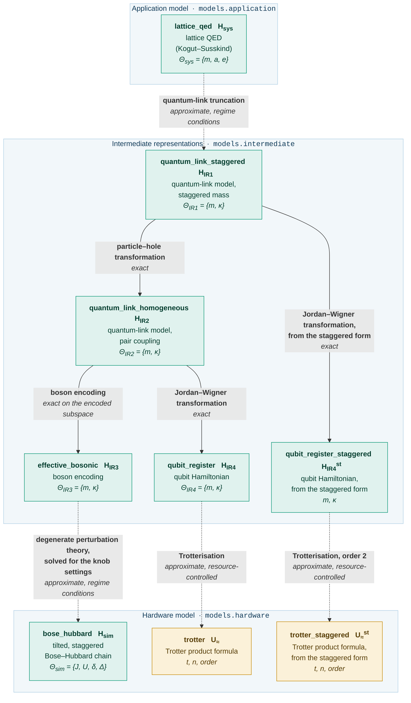

# Guide: the lattice Schwinger model

The case study of the article: a one-dimensional lattice quantum
electrodynamics (QED), the physical system model $\hat H_\text{sys}$, is
carried through intermediate representations to two hardware models of
different artifact kinds, an analogue simulator model $\hat H_\text{sim}$ (a
Bose-Hubbard chain, `bose_hubbard`) and a digital simulator model
$\hat U_\approx$ (a Trotter product formula, `trotter`), from a shared prefix.
For each artifact the page gives the Hamiltonian and the parameter set, for
each transformation the operator substitution, the exactness, the validity
conditions and the parameter relation.  It also introduces the machinery the
guides to [the Heisenberg magnet](heisenberg.md) and [the Ising
chain](ising.md) assume.

The physics follows Zhou et al. [1] and Yang et al. [2].  The text uses the notation of the
article, $\hat H_\text{sys}$, $\hat H_\text{IR1}$ to $\hat H_\text{IR4}$, $\hat H_\text{sim}$
and $\hat U_\approx$; the table below gives the operator names under which the package prints
the same objects, such as `H_QED` and `H_BHM`.

## The model graph

[`qsimod.usecases.schwinger`][qsimod.usecases.schwinger] assembles artifacts from
[`qsimod.models`][qsimod.models] and transformations from
[`qsimod.transformations`][qsimod.transformations] into a model graph.  A solid arrow is an
exact transformation and a dotted arrow an approximate one.  The second digital branch
(`qubit_register_staggered`, `trotter_staggered`) is omitted from the [overview](index.md).

<!-- Generated by scripts/figures.py from the graph this use case builds; do not edit by hand. -->



| Node | Article | Operator name in the code | Artifact | Parameter set |
|---|---|---|---|---|
| `lattice_qed` | $\hat H_\text{sys}$ | `H_QED` | lattice QED in the Kogut-Susskind formulation | $\Theta_\text{sys} = \{m, a, e\}$ |
| `quantum_link_staggered` | $\hat H_\text{IR1}$ | `H_QLM^st` | quantum-link model with staggered mass | $\Theta_\text{IR1} = \{m, \kappa\}$ |
| `quantum_link_homogeneous` | $\hat H_\text{IR2}$ | `H_QLM` | quantum-link model after the particle-hole transformation; the branch point | $\Theta_\text{IR2} = \{m, \kappa\}$ |
| `effective_bosonic` | $\hat H_\text{IR3}$ | `H_eff` | boson encoding of $\hat H_\text{IR2}$ | $\Theta_\text{IR3} = \{m, \kappa\}$ |
| `bose_hubbard` | $\hat H_\text{sim}$ | `H_BHM` | analogue simulator model: tilted, staggered Bose-Hubbard chain | $\Theta_\text{sim} = \{J, U, \delta, \Delta\}$ |
| `qubit_register` | $\hat H_\text{IR4}$ | `H_qubit` | qubit Hamiltonian, the Jordan-Wigner image of $\hat H_\text{IR2}$ | $\Theta_\text{IR4} = \{m, \kappa\}$ |
| `trotter` | $\hat U_\approx$ | `U_Trotter` | digital simulator model: Trotter product formula of $\hat H_\text{IR4}$ | `t`, `n`, order, and `m`, `kappa` |
| `qubit_register_staggered`, `trotter_staggered` | | `H_qubit^st` | the second digital branch, leaving `quantum_link_staggered`; see [the two branch points](#the-two-branch-points) | |

$N$ matter sites occupy $2N - 1$ interleaved register positions: matter site $l$ is at index
$2l$ and the gauge link $(l, l+1)$ at index $2l + 1$.  The bosonic artifacts have dimension
$3^{2N-1}$ at the cutoff $n_\text{max} = 2$ the boson encoding requires; the two-states-per-site
subspace is a declaration on the artifact, not a property of the array.

| Node | Artifact kind | Matter | Gauge | Parameters | Terms | Dimension (N=3 / N=4) |
|---|---|---|---|---|---|---|
| `lattice_qed` | Hamiltonian | fermion | untruncated U(1) link | `m`, `a`, `e`, `electric_gap` | 9 | **not realisable** |
| `quantum_link_staggered` | Hamiltonian | fermion | spin-1/2 | `m`, `kappa` | 7 | 32 / 128 |
| `quantum_link_homogeneous` | Hamiltonian | fermion | spin-1/2 | `m`, `kappa` | 8 | 32 / 128 |
| `effective_bosonic` | Hamiltonian | boson | boson | `m`, `kappa` | 8 | 243 / 2187 |
| `bose_hubbard` | Hamiltonian | boson | boson | `J`, `U`, `delta`, `Delta` | 23 | 243 / 2187 |
| `qubit_register` | Hamiltonian | qubit | qubit | `m`, `kappa` | 8 | 32 / 128 |
| `qubit_register_staggered` | Hamiltonian | qubit | qubit | `m`, `kappa` | 7 | 32 / 128 |
| `trotter` | **product formula** | qubit | qubit | `t`, `n`, `2k` (and `m`, `kappa`) | — | 32 / 128 |
| `trotter_staggered` | **product formula** | qubit | qubit | `t`, `n`, `2k` (and `m`, `kappa`) | — | 32 / 128 |

Parameter names are namespaced by the artifact that owns them (`bose_hubbard.J`,
`effective_bosonic.kappa`); the fully qualified names are constants on
[`ParameterNames`][qsimod.usecases.schwinger.ParameterNames].

## What an artifact carries

Every node is an [`Artifact`][qsimod.artifact.Artifact] with a structural type, a parameter set
and a binding of the parameters.  A [`HamiltonianModel`][qsimod.artifact.HamiltonianModel]
additionally carries:

| Declaration | Content |
|---|---|
| `hamiltonian` | a symbolic sum of operator products |
| `constraint_operators` | the generators of a declared symmetry, here the Gauss operators `G_l`, each with a target eigenvalue |
| `sector` | the superselection sector in which physical states live |
| `local_subspace` | a declared per-site occupation subspace |
| `dropped_constants` | the additive constants discarded by the transformations that produced the artifact, with their values |

The structural type declares only that a symmetry exists, by name, group and locality; this is
what a transformation type-checks against.  The generators themselves are data on the model.

## The transformations at a glance

| Transformation | From | To | Exactness | Kind of approximation | Relation, forward | Relation, inverse |
|---|---|---|---|---|---|---|
| [quantum-link truncation][qsimod.transformations.truncations.quantum_link_truncation] | `lattice_qed` | `quantum_link_staggered` | `APPROXIMATE` | regime conditions | `CLOSED_FORM` | `CLOSED_FORM` |
| [particle-hole transformation][qsimod.transformations.basis_changes.particle_hole_transformation] | `quantum_link_staggered` | `quantum_link_homogeneous` | `EXACT` | — | `CLOSED_FORM` | `CLOSED_FORM` |
| [boson encoding][qsimod.transformations.encodings.hardcore_boson_encoding] | `quantum_link_homogeneous` | `effective_bosonic` | `EXACT` on the encoded subspace | — | `CLOSED_FORM` | `CLOSED_FORM` |
| [second-order perturbation theory][qsimod.transformations.perturbative.second_order_perturbation_theory] | `effective_bosonic` | `bose_hubbard` | `APPROXIMATE` | regime conditions | `CLOSED_FORM` | `UNDER_DETERMINED` |
| [Jordan-Wigner transformation][qsimod.transformations.basis_changes.jordan_wigner_to_qubits] | `quantum_link_homogeneous` | `qubit_register` | `EXACT` | — | `CLOSED_FORM` | `CLOSED_FORM` |
| [Jordan-Wigner transformation from `quantum_link_staggered`][qsimod.transformations.basis_changes.jordan_wigner_to_qubits] | `quantum_link_staggered` | `qubit_register_staggered` | `EXACT` | — | `CLOSED_FORM` | `CLOSED_FORM` |
| [Trotterisation][qsimod.transformations.trotterisation.suzuki_trotter] | `qubit_register` | `trotter` | `APPROXIMATE` | resource-controlled | `CLOSED_FORM` | `CLOSED_FORM` |

The relation of the perturbative step is derived from the hardware model to the effective
theory: a closed form from the knobs to the effective parameters, and under-determined in the
inverse direction, the solve for the knob settings.

## The attributes of a transformation

A [`Transformation`][qsimod.transform.Transformation] is a declaration before it is a
computation.  Three independent attributes are checked when it is applied:

| Attribute | Fields | Question decided |
|---|---|---|
| **structural type and artifact kind** | `source_pattern`, `source_kind` | May this transformation be applied to this artifact? |
| **exactness** | `exactness` | Is the target unitarily equivalent to the source?  An `EXACT` transformation is checked on every application: the source Hamiltonian is rewritten in the operators of the target ([`image`][qsimod.transform.Transformation.image]) and compared with the target model in [normal form][qsimod.normal_form]; a mismatch raises [`ExactnessError`][qsimod.transform.ExactnessError]. |
| **kind of approximation** | `approximation.kind` | Is the error bounded by regime conditions on the parameters, or controlled by a resource parameter? |

Whether the hardware can be tuned to the coefficients the operator form demands is a property
of the parameter relation and is resolved by [posing a solve](#posing-a-solve).

## Reading a transformation

```python
from qsimod.usecases.schwinger import perturbation

step = perturbation()
print(step)  # name, exactness, approximation kind
print(step.relation)  # the equations
print(step.validity)  # the condition names
print(step.forward_relation_kind)  # CLOSED_FORM
print(step.inverse_relation_kind)  # UNDER_DETERMINED
print(step.source_pattern)  # what it demands
print(step.target_pattern)  # what it guarantees
```

## `lattice_qed`: the physical system model

**Use case:** [`theory`][qsimod.usecases.schwinger.theory] &nbsp;·&nbsp; **library:** [`kogut_susskind_gauge_theory`][qsimod.models.application.kogut_susskind_gauge_theory]

$$
\hat H_\text{sys} = \frac{a}{2} \sum_l \hat E_{l,l+1}^2
  + m \sum_l (-1)^l \hat\psi_l^\dagger \hat\psi_l
  - \frac{i}{2a} \sum_l \left( \hat\psi_l^\dagger \hat U_{l,l+1} \hat\psi_{l+1} - \text{h.c.} \right)
$$

Staggered spinless fermions $\hat\psi_l$ live on $N$ sites with spacing $a$; the electric field
$\hat E_{l,l+1}$ and the compact U(1) link operator $\hat U_{l,l+1}$, which shifts it by one unit, live on
the links.  The alternating sign of the mass term places particles on even and antiparticles on
odd sites.  Gauss's law is recorded on the artifact as generators with target eigenvalues,

$$
\hat G_l = \hat E_{l,l+1} - \hat E_{l-1,l} - e \left[ \hat n_l - \tfrac{1 - (-1)^l}{2} \right]
$$

with target `0` in the bulk, `-1/2` at $l = 0$ and $(-1)^{N} / 2$ at $l = N-1$, where the
boundary generators omit one link.

The parameter set is $\Theta_\text{sys} = \{m, a, e\}$; a fourth parameter, `electric_gap`, is used by no
term and carries the energy cost $a e^{2} / 2$ of one extra unit of electric flux, against which
the validity condition of the truncation is evaluated.  The link is an infinite-dimensional
degree of freedom ([`Algebra.GAUGE_LINK_U1`][qsimod.structure.Algebra]), so the artifact has no
finite matrix representation, yet type-checks the transformations that follow:

```python
from qsimod.realise import HilbertSpace
from qsimod.usecases.schwinger import theory

try:
    HilbertSpace.of(theory(3).structure)
except ValueError as error:
    print(error)
# cannot realise H_QED: degree(s) of freedom ['gauge'] have no finite-dimensional
# representation
```

## `lattice_qed` -> `quantum_link_staggered`: the quantum-link truncation

The field values of a link are cut down to the two lowest, which leaves a spin-1/2 on each link:

$$
\hat U_{l,l+1} \to \tfrac{2}{\sqrt 3}\, \hat S^+_{l,l+1}, \qquad
\hat E_{l,l+1} \to e\, \hat S^z_{l,l+1}
$$

in units of $e = 1$, $a = 1$.  The factor $-i$ of the coupling is absorbed into the phase of the
link operator, $\hat U \to -i (2/\sqrt{3}) \hat S^+$, which gives the real form $(\kappa/2)(\ldots + \text{h.c.})$.

**Exactness:** `APPROXIMATE`.  The truncation is faithful if the dynamics does not populate the
discarded field values, that is if the coupling is small against the gap to the first of them.
No resource parameter reduces the error.

| Condition | Severity | Quantity | Threshold |
|---|---|---|---|
| `field sector within truncation` | regime | `kappa/(a e^2/2)` | **1.0** |

**Discarded constant.**  Since $\hat S^z$ squared is `1/4`, the electric energy becomes the constant
$(N-1) a e^2 / 8$, which is dropped and recorded on the target with its value:

```python
from qsimod.usecases.schwinger import ParameterNames as P
from qsimod.usecases.schwinger import theory, truncation

bound = theory(3).bind(
    **{P.MASS_LATTICE_QED: 0.0, P.LATTICE_SPACING: 1.0, P.GAUGE_COUPLING: 1.0, P.ELECTRIC_GAP: 0.5}
)
truncated = truncation().apply(bound)
print(truncated.dropped_constants[0])  # (a/2) sum_l E^2 -> (N-1) a e^2 / 8 = 0.25
```

**Parameter relation.**  Taken literally, the substitution fixes the coupling at $2/\sqrt{3}$.
From `quantum_link_staggered` on, $\kappa$ is instead released as the tunable coupling of the
simulated theory, so the relation carries only the mass, `quantum_link_staggered.m =
lattice_qed.m`: one equation for two target parameters, which leaves the composite pipeline two
residual degrees of freedom.

## `quantum_link_staggered`: the quantum-link model with staggered mass

**Use case:** [`staggered_quantum_link`][qsimod.usecases.schwinger.staggered_quantum_link] &nbsp;·&nbsp; **library:** [`quantum_link_model`][qsimod.models.intermediate.quantum_link_model] at [`STAGGERED_CONVENTION`][qsimod.models.intermediate.STAGGERED_CONVENTION]

$$
\begin{aligned}
\hat H_\text{IR1} &= \sum_l \left[ \frac{\kappa}{2} \left( \hat\psi_l^\dagger \hat S^+_{l,l+1} \hat\psi_{l+1} + \text{h.c.} \right) + m (-1)^l \hat\psi_l^\dagger \hat\psi_l \right] \\
\hat G_l &= \hat S^z_{l,l+1} - \hat S^z_{l-1,l} - \left[ \hat n_l - \tfrac{1 - (-1)^l}{2} \right]
\end{aligned}
$$

This is Eq. (S1) of [1].  $\kappa$ is a parameter of this artifact and is bound
here, not at `lattice_qed`:

```python
from qsimod.usecases.schwinger import ParameterNames as P
from qsimod.usecases.schwinger import build_graph

graph = build_graph(3)
staggered = graph.graph.node("quantum_link_staggered").bind(
    **{P.MASS_QUANTUM_LINK_STAGGERED: 0.41, P.COUPLING_QUANTUM_LINK_STAGGERED: 0.83}
)
print(staggered.is_fully_bound)  # True
print(staggered.pretty())  # the Hamiltonian, with psi on the fermionic sites
```

## `quantum_link_staggered` -> `quantum_link_homogeneous`: the particle-hole transformation

On every odd matter site occupied and empty are exchanged, and on every even link the spin is
flipped:

$$
\begin{aligned}
\text{odd matter sites } l = 1, 3, 5, \ldots: \quad & \hat n_l \to 1 - \hat n_l, & \hat\psi_l \to \hat\psi_l^\dagger \\
\text{even links } (l, l+1),\ l = 0, 2, \ldots: \quad & \hat S^z \to -\hat S^z, & \hat S^\pm \to \hat S^\mp
\end{aligned}
$$

**Exactness:** `EXACT`, a unitary change of variables, and checked on application against the
library's $\hat H_\text{IR2}$ in normal form.  The alternating sign of the mass term disappears, and the
hopping becomes a pair term that creates or annihilates a particle-antiparticle pair across a
link.  The two parities must be opposite: flipping the odd matter sites with the even links
passes $+m$ to the target, the convention taken here; the other valid combination passes $-m$
and inverts the phase assignment at large mass.

**Parameter relation:** an identity on both parameters.  The staggering leaves the constant
$- m\,\lfloor N/2 \rfloor$, which is retained as an identity term.

## `quantum_link_homogeneous`: the quantum-link model with pair coupling

**Use case:** [`homogeneous_quantum_link`][qsimod.usecases.schwinger.homogeneous_quantum_link] &nbsp;·&nbsp; **library:** [`quantum_link_model`][qsimod.models.intermediate.quantum_link_model] at [`HOMOGENEOUS_CONVENTION`][qsimod.models.intermediate.HOMOGENEOUS_CONVENTION]

$$
\begin{aligned}
\hat H_\text{IR2} &= \sum_l \left[ \frac{\kappa}{2} \left( \hat\psi_l \hat S^+_{l,l+1} \hat\psi_{l+1} + \text{h.c.} \right) + m \hat\psi_l^\dagger \hat\psi_l \right] - m \lfloor N/2 \rfloor \\
\hat G_l &= \hat S^z_{l-1,l} + \hat S^z_{l,l+1} + \hat n_l
\end{aligned}
$$

The coupling is a pair creation and annihilation term, so the total matter charge is not
conserved.  The Gauss targets are zero in the bulk and `+1/2` at both ends;
[`sector_projector`][qsimod.realise.build.sector_projector] builds the sector projector from the
declared per-operator eigenvalues, boundary included.  This artifact is the branch point: the
analogue branch continues with the boson encoding, the digital branch with the Jordan-Wigner
transformation.

## Analogue simulation branch

### `quantum_link_homogeneous` -> `effective_bosonic`: the boson encoding

The two-level degrees of freedom are expressed by atom numbers: an occupied or empty matter
site by one or zero atoms, an up or down link spin by two or zero atoms.  Matter site $l$ is
identified with position $2l$ and link $(l,l+1)$ with position $2l+1$:

$$
\begin{aligned}
\hat\sigma^-_l &= \hat P_l \hat a_l \hat P_l, & \hat S^- &= \tfrac{1}{\sqrt 2} \hat P \hat d^2 \hat P, \\
\hat\sigma^z_l &= \hat P_l \left( 2 \hat a_l^\dagger \hat a_l - 1 \right) \hat P_l, & \hat S^z &= \tfrac12 \hat P \left( \hat d^\dagger \hat d - 1 \right) \hat P
\end{aligned}
$$

**Exactness:** `EXACT` on the encoded subspace.  The identities hold as $A = \hat P B \hat P$; outside
the subspace, with two atoms on a matter site or one on a link site, $\hat H_\text{IR3}$ does not preserve
it.  The target declares the allowed occupations per site, [`sandwich`][qsimod.realise.build.sandwich]
produces $\hat P \hat H \hat P$, and [`restrict`][qsimod.realise.build.restrict] extracts the
$2^{2N-1}$-dimensional block; at the reference point the spectra agree to `1.7e-16`.

### `effective_bosonic`: the effective bosonic model

**Use case:** [`effective_bosonic`][qsimod.usecases.schwinger.effective_bosonic] &nbsp;·&nbsp; **library:** [`bosonic_pair_coupling_model`][qsimod.models.intermediate.bosonic_pair_coupling_model]

$$
\hat H_\text{IR3} = \sum_{\substack{j\ \text{even} \\ 0 \le j \le 2N-4}} \left[ \frac{\kappa}{2\sqrt 2}\, \hat b_j \hat b_{j+2} \big(\hat b_{j+1}^\dagger\big)^2 + \text{h.c.} \right]
  + \sum_{\substack{j\ \text{even} \\ 0 \le j \le 2N-2}} m \hat n_j
  - m \lfloor N/2 \rfloor
$$

Two atoms on neighbouring matter sites jointly move onto the link site between them, and back.
The declared subspace
([`local_occupation_subspace`][qsimod.models.gauge.local_occupation_subspace]) admits
`n in {0, 1}` on matter positions and `n in {0, 2}` on link positions, so a realisation needs
$n_\text{max} \ge 2$.  $\hat H_\text{IR3}$ itself does not preserve the subspace, since the Hermitian partner of the
coupling raises a matter occupation to two; the leakage operator has norm $\sqrt{2}\,\kappa$, and
$\hat P \hat H_\text{IR3} \hat P$ is the exact operator.

### `effective_bosonic` -> `bose_hubbard`: second-order perturbation theory

The pair tunnelling of $\hat H_\text{IR3}$ is realised by single-atom tunnelling at a resonance: one atom on
each of two neighbouring matter sites and both atoms on the link between them have the same
energy at $U \approx 2 \delta$, while the intermediate configurations lie off by $\delta \pm \Delta$ and
$U - \delta \pm \Delta$.  Degenerate perturbation theory to second order gives the effective
parameters as functions of the knobs, the forward direction of the derivation:

$$
m = \delta - \frac{U}{2}, \qquad
\kappa = \sqrt 2\, J^2 \left[ \frac{1}{\delta + \Delta} + \frac{1}{\delta - \Delta}
  + \frac{1}{U - \delta + \Delta} + \frac{1}{U - \delta - \Delta} \right]
$$

The tilt $\Delta$ suppresses a competing two-step process that would violate Gauss's law, so
$\Delta = 0$ is not admissible.

**Parameter relation.**  Five solved forms for two equations:

| Solved form | Solves | Note |
|---|---|---|
| `effective_bosonic.m := delta - U/2` | mass | |
| `effective_bosonic.kappa := sqrt(2) J^2 (...)` | coupling | |
| `bose_hubbard.delta := m + U/2` | mass | at fixed `U` |
| `bose_hubbard.U := 2(delta - m)` | mass | at fixed `delta` |
| `bose_hubbard.J := sqrt(kappa / (sqrt(2) * pole sum))` | coupling | positive branch, at fixed `(U, delta, Delta)` |

**Validity conditions.**  Four domain conditions exclude the poles of the coupling formula and
six regime conditions ensure the assumptions of the expansion.  A regime condition $a \ll b$ is
evaluated as $a/b \le \theta$ with the default `theta = 0.1`; a domain failure is a pole and is
never overridable.

| Condition | Severity | Quantity | Threshold | Origin |
|---|---|---|---|---|
| `pole: delta != +Delta` | domain | `abs(delta-Delta)/delta` | 1e-3 | first pole |
| `pole: delta != -Delta` | domain | `abs(delta+Delta)/delta` | 1e-3 | second pole |
| `pole: U-delta != +Delta` | domain | `abs(U-delta-Delta)/U` | 1e-3 | third pole |
| `pole: U-delta != -Delta` | domain | `abs(U-delta+Delta)/U` | 1e-3 | fourth pole |
| `J << delta` | regime | `J/delta` | 0.1 | perturbative expansion parameter |
| `J << U` | regime | `J/U` | 0.1 | perturbative expansion parameter |
| `abs(m) << U  (U ~= 2 delta)` | regime | `abs(m)/U` | 0.1 | near-degeneracy of the manifold |
| `Delta << delta` | regime | `Delta/delta` | 0.1 | the tilt must not disturb the manifold |
| `Delta << U` | regime | `Delta/U` | 0.1 | the tilt must not disturb the manifold |
| `kappa << Delta` | regime | `kappa/Delta` | 0.1 | the tilt must suppress two-site tunnelling |

A report gives, per condition, the quantity, its value, the requirement and the margin in
decades of slack:

```python
from qsimod.usecases.schwinger import ParameterNames as P, validity

report = validity().report(
    {
        P.TUNNELLING: 0.02,
        P.INTERACTION: 1.0,
        P.SUPERLATTICE: 0.52,
        P.TILT: 0.048,
        P.MASS_EFFECTIVE_BOSONIC: 0.02,
        P.COUPLING_EFFECTIVE_BOSONIC: 0.004525,
    }
)
print(report)
print(report.weakest())  # which condition is closest to failing
```

The declared regime is two-sided, $\kappa \ll \Delta \ll \delta, U$; under the default objective the
solve lands where $\Delta \ll \delta$ and $\kappa \ll \Delta$ have equal margins.  The leading
correction is of fourth order in $J$, a relative error scaling like $(J/U)^2$.

The framework has to run the derivation backwards, from $(m, \kappa)$ to $\Theta_\text{sim}$, a system
of two equations in four unknowns.  Applying the transformation therefore returns the hardware
model with its parameters unbound; the knob settings come from [a solve](#posing-a-solve):

```python
from qsimod.usecases.schwinger import ParameterNames as P, build_graph

graph = build_graph(3)
theory = graph.graph.node("lattice_qed").bind(
    **{
        P.MASS_LATTICE_QED: 0.02,
        P.LATTICE_SPACING: 1.0,
        P.GAUGE_COUPLING: 1.0,
        P.ELECTRIC_GAP: 0.5,
    }
)
target = graph.analogue.apply(theory)
print(target)  # bose_hubbard <Hamiltonian> H_BHM [unbound]
print(target.free_parameters)
# ('bose_hubbard.J', 'bose_hubbard.U', 'bose_hubbard.delta', 'bose_hubbard.Delta')
```

### `bose_hubbard`: the analogue simulator model

**Use case:** [`superlattice`][qsimod.usecases.schwinger.superlattice] &nbsp;·&nbsp; **library:** [`tilted_bose_hubbard_chain`][qsimod.models.hardware.tilted_bose_hubbard_chain]

$$
\hat H_\text{sim} = -J \sum_{j=0}^{2N-3} \left( \hat b_j^\dagger \hat b_{j+1} + \text{h.c.} \right)
  + \sum_{j=0}^{2N-2} \left[ \frac{U}{2} \hat n_j (\hat n_j - 1) + \epsilon_j \hat n_j \right], \qquad
\epsilon_j = (-1)^j \frac{\delta}{2} + j \Delta
$$

A chain of neutral atoms in an optical superlattice.  The knobs are the tunnelling $J$, the
on-site interaction $U$, the superlattice depth $\delta$, which alternates the site energies
between matter and link positions, and the tilt $\Delta$, a linear energy slope.  The admissible
set of the knobs is attached to the artifact:

```python
from qsimod.usecases.schwinger import device_limits

print(device_limits())
# optical superlattice simulator: bose_hubbard.J in (0, 0.25]; bose_hubbard.U in [0.05, 4];
#   bose_hubbard.delta in (0, 2.5]; bose_hubbard.Delta in (0, 0.6];
#   tilt within the superlattice depth: (0.5*bose_hubbard.delta - bose_hubbard.Delta) >= 0;
#   tilt within the resonance gap:
#     (0.5*(bose_hubbard.U - bose_hubbard.delta) - bose_hubbard.Delta) >= 0
```

$J = 0$ and $\Delta = 0$ are excluded strictly, and the two coupled constraints keep the tilt
away from the poles of the coupling formula.  The perturbative manifold, `|101>` and `|020>` on
each three-site block, is not the ground-state manifold of $\hat H_\text{sim}$; the declared local subspace
records which subspace is meant.

## Digital simulation branch

### `quantum_link_homogeneous` -> `qubit_register`: the Jordan-Wigner transformation

The spin-1/2 of a link is already a qubit; the fermionic matter sites acquire parity strings,
which the Jordan-Wigner transformation attaches to each qubit operator.  Matter sites and links
share one register of $2N - 1$ qubits, in the layout of the optical lattice:

$$
\begin{aligned}
\hat\psi_l^\dagger \hat\psi_l &\to \tfrac12 \left( \hat\sigma^z_{2l} + 1 \right), &
\hat\psi_l \hat\psi_{l+1} &\to \hat\sigma^-_{2l} \hat\sigma^-_{2l+2}, \\
\hat S^\pm_{l,l+1} &\to \hat\sigma^\pm_{2l+1}, &
\hat S^z_{l,l+1} &\to \tfrac12 \hat\sigma^z_{2l+1}
\end{aligned}
$$

**Exactness:** `EXACT`.  The string runs over the matter sites only and each coupling joins
adjacent matter sites, so the strings collapse to a sign; a longer-range coupling would leave a
string.  The sign convention is the alternating-sign map of
[`qsimod.realise.build`][qsimod.realise.build], so the fermionic realisation of
`quantum_link_homogeneous` and the qubit realisation of `qubit_register` are identical matrices.

#### The two branch points

The particle-hole transformation is needed by the analogue branch but not by the digital one,
so the digital branch may also leave from `quantum_link_staggered`, by
[`to_qubits_from_staggered`][qsimod.usecases.schwinger.to_qubits_from_staggered]; the two qubit
Hamiltonians are unitarily equivalent:

```python
from qsimod.realise import HilbertSpace, build_operator, eigensystem
from qsimod.usecases.schwinger import (
    ParameterNames as P,
    build_graph,
    to_qubits_from_staggered,
    to_qubits,
    particle_hole,
)

staggered = (
    build_graph(4)
    .graph.node("quantum_link_staggered")
    .bind(**{P.MASS_QUANTUM_LINK_STAGGERED: 0.41, P.COUPLING_QUANTUM_LINK_STAGGERED: 0.83})
)
via_homogeneous = to_qubits().apply(particle_hole().apply(staggered))
via_staggered = to_qubits_from_staggered().apply(staggered)
# identical spectra to 1e-10, a numerical check of the two exact transformations
```

### `qubit_register`: the qubit Hamiltonian

**Use case:** [`qubit_register`][qsimod.usecases.schwinger.qubit_register] &nbsp;·&nbsp; **library:** [`k_local_qubit_model`][qsimod.models.intermediate.k_local_qubit_model]

$$
\hat H_\text{IR4} = \sum_{l=0}^{N-2} \frac{\kappa}{2} \left( \hat\sigma^-_{2l} \hat\sigma^+_{2l+1} \hat\sigma^-_{2l+2} + \text{h.c.} \right)
  + \sum_{l=0}^{N-1} m \hat n_{2l} - m \lfloor N/2 \rfloor
$$

Each coupling term acts on three qubits and expands into four mutually commuting Pauli
products, $\tfrac14 (X_a X_b X_c + X_a Y_b Y_c - Y_a X_b Y_c + Y_a Y_b X_c)$, so its exponential
factorises exactly into four three-qubit rotations.  Every term commutes with every Gauss
operator.  The full Hamiltonian is a sum of non-commuting terms, which is why the digital branch
needs the Trotterisation.  `qubit_register_staggered`, the image of the other branch point, is
the same construction in the staggered convention.

### `qubit_register` -> `trotter`: the Trotterisation

The only transformation of the case study that changes the artifact kind: `source_kind` is
`HAMILTONIAN` and `target_kind` is `PRODUCT_FORMULA`.  The simulated time, the step count and
the order are fields of the transformation:

```python
from qsimod.usecases.schwinger import trotterisation

step = trotterisation(time=2.0, steps=16, order=2)
print(step.approximation)
# resource-controlled [resources: steps, order]; leading error O(t^(p+1) / n^p) at order p
```

**Layer decomposition.**  $\hat H_\text{IR4}$ is grouped into three layers whose terms mutually commute,
each of which exponentiates exactly into one rotation per Pauli string:

| Layer | Terms | Property |
|---|---|---|
| $\hat H_\text{M}$ | `sum_l (m/2) sigma^z_{2l}` | diagonal; exactly exponentiable |
| $\hat H_\text{even}$ | coupling on even links | pairwise disjoint support |
| $\hat H_\text{odd}$ | coupling on odd links | pairwise disjoint support |

The layers do not commute with each other, which the framework establishes as an exact Pauli
sum; the a-priori error bound sums over the non-commuting pairs only:

```python
from qsimod.transformations import interleaved_layers_of
from qsimod.usecases.schwinger import (
    ParameterNames as P,
    build_graph,
    particle_hole,
    to_qubits,
)

staggered = (
    build_graph(4)
    .graph.node("quantum_link_staggered")
    .bind(**{P.MASS_QUANTUM_LINK_STAGGERED: 0.41, P.COUPLING_QUANTUM_LINK_STAGGERED: 0.83})
)
qubits = to_qubits().apply(particle_hole().apply(staggered))

layers = interleaved_layers_of(qubits)
print(layers.commutation_report())
# [H_M, H_even]: do NOT commute (8 strings)
# [H_M, H_odd]: do NOT commute (4 strings)
# [H_even, H_odd]: do NOT commute (16 strings)
```

**Exactness:** `APPROXIMATE`, with the error $O(t^{p+1} / n^p)$ controlled by the step count
$n$ and the order $p$ (one, two or four), not by regime conditions.

**Step count.**  Choosing $n$ for a requested accuracy is a solve like the knob settings of the
analogue branch: an integer unknown, an inequality on the a-priori bound, and the minimal
resource cost as objective:

```python title="continued"
from qsimod.solving.backends.integer import minimal_resource_setting
from qsimod.solving.stepcount import STEPS_SYMBOL, minimal_steps, resource_candidates
from qsimod.trotter import SpectralNormEstimator

estimator = SpectralNormEstimator(len(qubits.structure.sites))  # 7 qubits at N = 4
outcome = minimal_steps(layers, order=2, time=2.0, target_error=1e-3, estimator=estimator)
print(int(outcome.point[STEPS_SYMBOL]), outcome.notes["minimality"])
# 30  trotter.n = 30 satisfies the constraints and 29 does not

candidates = resource_candidates(layers, 2.0, 1e-3, orders=(1, 2, 4), estimator=estimator)
print(minimal_resource_setting(candidates))
# order 2: n=30, 840 k-local factors, depth 600, bound 9.981e-04
```

Resources are counted in k-local unitaries and in layers acting on disjoint qubits, not in
CNOTs, since a CNOT count needs the gate set of the executable layer; see
[`ResourceSummary`][qsimod.trotter.schedule.ResourceSummary].

### `U_approx` (`trotter`): the digital simulator model

A [`ProductFormulaModel`][qsimod.trotter.schedule.ProductFormulaModel] is not a Hamiltonian.  It
carries the qubit register, an ordered sequence of factors $\exp(-i \theta \hat P)$ repeated over $n$
steps according to the formula $S_{2k}$, the parameters $t$, $n$, $2k$ with the a-priori error
bound, and a resource summary.  It stores the layer decomposition and the stage schedule rather
than the flattened factor list, so its size is independent of $n$:

```python
from qsimod.usecases.schwinger import (
    ParameterNames as P,
    build_graph,
    to_qubits,
    particle_hole,
    trotterisation,
)
from qsimod.trotter import as_product_formula

staggered = (
    build_graph(50)
    .graph.node("quantum_link_staggered")
    .bind(**{P.MASS_QUANTUM_LINK_STAGGERED: 0.41, P.COUPLING_QUANTUM_LINK_STAGGERED: 0.83})
)
qubits = to_qubits().apply(particle_hole().apply(staggered))
formula = as_product_formula(trotterisation(time=2.0, steps=8, order=1).apply(qubits))
print(formula.resources())  # 99 qubits, factors, depth in layers, error bound
```

Here the two branches cease to be comparable objects: $\hat U_\approx$ is a circuit whose accuracy is
bought with resources, $\hat H_\text{sim}$ a Hamiltonian whose validity is a regime in $\Theta_\text{sim}$.  A
transformation that expects a Hamiltonian rejects the product formula with an
[`ArtifactKindError`][qsimod.artifact.ArtifactKindError].

## Numerical realisation

An artifact with a finite structural type and every parameter bound is realised as a dense
`complex128` JAX array; the bosonic cutoff is part of the request, not of the artifact:

```python
from qsimod.realise import HilbertSpace, RealisationRequest, build_operator
from qsimod.usecases.schwinger import ParameterNames as P, superlattice

model = superlattice(3)
space = HilbertSpace.of(model.structure, RealisationRequest(boson_cutoff=2))
print(space)  # dimension 243 (3x3x3x3x3), n_max=2
print(space.label(space.index_of((1, 0, 1, 0, 1))))  # |1 0 1 0 1>

operator = build_operator(
    model.hamiltonian,
    space,
    {
        P.TUNNELLING: 0.02,
        P.INTERACTION: 1.0,
        P.SUPERLATTICE: 0.52,
        P.TILT: 0.048,
    },
)
```

Register site 0 is the leftmost tensor factor; see
[`HilbertSpace`][qsimod.realise.hilbert.HilbertSpace] for the basis conventions.  Time evolution
is computed exactly by eigendecomposition ([`qsimod.realise.evolve`][qsimod.realise.evolve]).
This is how the exact transformations are shown to be unitarily equivalent to numerical
precision, and every Hamiltonian that declares Gauss's law to commute with its generators.

## Composing transformations into a pipeline

Transformations compose into a [`Pipeline`][qsimod.pipeline.Pipeline], itself a
`Transformation`, and the composition is type-checked without any artifact in hand:

```python
from qsimod.pipeline import CompositionError, Pipeline
from qsimod.usecases.schwinger import encoding, truncation

try:
    Pipeline.of([encoding(), truncation()])
except CompositionError as error:
    print(error)
    print([gap.aspect for gap in error.gaps])
# cannot compose 'Jordan-Wigner + hardcore-boson encoding' with 'spin-1/2 quantum-link
# truncation': dof[matter].algebra: requires fermion, found boson; ...
```

| Composite attribute | Rule |
|---|---|
| structural types | unified pairwise, at composition time |
| exactness | `EXACT` if and only if every transformation is exact |
| kinds of approximation | the set of the transformations' kinds; the analogue branch is `{regime-limited}`, the digital branch `{regime-limited, resource-controlled}` |
| validity condition | the conjunction of the transformations' conditions |
| parameter relation | the union of the transformations' equations, with the intermediate parameters left free |

The composed relation is one solver problem over the whole pipeline, because a parameter left
free by one transformation may be fixed by a later one:

```python
from qsimod.usecases.schwinger import ParameterNames as P, build_graph

graph = build_graph(3)
targets = {
    P.MASS_LATTICE_QED: 0.02,
    P.COUPLING_QUANTUM_LINK_STAGGERED: 0.004525,
    P.ELECTRIC_GAP: 0.5,
}
classification = graph.analogue.classify_relation(frozenset(targets))
print(classification)
# UNDER_DETERMINED: 7 equation(s), 9 unknown(s) (...); 2 residual degree(s) of freedom
```

Nine unknowns, the four knobs and five intermediate parameters, against seven equations leave
two residual degrees of freedom, so a single knob setting needs two further conditions or an
objective.

## Posing a solve

The knob settings are found in the inverse direction of the derivation, by a constrained solve:

```python
from qsimod.usecases.schwinger import ParameterNames as P, device_limits, build_graph
from qsimod.solving import realise_parameters

graph = build_graph(3)
targets = {
    P.MASS_LATTICE_QED: 0.02,
    P.COUPLING_QUANTUM_LINK_STAGGERED: 0.004525,
    P.ELECTRIC_GAP: 0.5,
}
knobs = [P.TUNNELLING, P.INTERACTION, P.SUPERLATTICE, P.TILT]

result = realise_parameters(
    graph.analogue,
    targets=targets,
    unknowns=knobs,
    admissible_set=device_limits(),
)
print(result)  # status, point, per-equation residuals, objective, every margin
```

The backend runs SciPy's SLSQP over the admissible ranges, with the parameter relations as
equality constraints, the domain and regime conditions as inequality constraints, and analytic
gradients through JAX.  The result carries a [`SolveStatus`][qsimod.solving.result.SolveStatus]:
`EXACT_SOLUTION`, `APPROXIMATE_SOLUTION` with a per-parameter residual, `INFEASIBLE` with the
binding constraint named, proved by interval arithmetic before any search runs, or `UNSOLVED`.
An under-determined system is resolved by an objective, by default the maximisation of the
weakest validity margin:

```python title="continued"
from qsimod.scalar import Symbol
from qsimod.solving import minimise

frugal = realise_parameters(
    graph.analogue,
    targets=targets,
    unknowns=knobs,
    admissible_set=device_limits(),
    objective=minimise(Symbol(P.INTERACTION), name="minimise U"),
)
print(result.point[P.INTERACTION], frugal.point[P.INTERACTION])  # 4.0  0.865
```

Where the relation is a closed form in the requested direction, no optimiser is constructed.
[`error_report`][qsimod.pipeline.Pipeline.error_report] reports the errors of a pipeline on
separate axes: the structural approximations, the residual of the solve, the regime margins,
and the error of a resource-controlled transformation against its cost.

## Discarded constants

| Transformation | Constant | Treatment |
|---|---|---|
| quantum-link truncation | `(a/2) sum_l E^2` -> `(N-1) a e^2 / 8` | **dropped**; recorded with its value on the target artifact (`HamiltonianModel.dropped_constants`) |
| particle-hole transformation | `- m * floor(N/2)` from the mass staggering | **retained** as an identity term |
| boson encoding, Jordan-Wigner transformations | — | inherited unchanged |
| Trotterisation | — | the identity string of the mass layer becomes a global phase |

`Pipeline.dropped_constants()` lists the transformations of a pipeline that discard a constant.

## Adding a hardware model

New theories and hardware models are added through
[`ModelTransformation`][qsimod.transformations.base.ModelTransformation]: a subclass implements
the method that builds its target artifact, and
[`target_sites`][qsimod.transform.Transformation.target_sites] if the register size changes.
Its validity conditions are declared with [`conjunction`][qsimod.validity.conjunction] and are
picked up by the solving layer, and the new artifact and transformation take part in the model
graph through `graph.add_node` and `graph.add_edge`.  `tests/test_extensibility.py` adds a third
hardware model, a transverse-field Ising chain, and a second physical system model from outside
the package, and is the worked example of the extension points.

## References

1. Z.-Y. Zhou, G.-X. Su, J. C. Halimeh, R. Ott, H. Sun, P. Hauke, B. Yang, Z.-S. Yuan,
   J. Berges and J.-W. Pan, *Thermalization dynamics of a gauge theory on a quantum
   simulator*, Science **377**, 311-314 (2022).
   [doi:10.1126/science.abl6277](https://doi.org/10.1126/science.abl6277)
2. B. Yang, H. Sun, R. Ott, H.-Y. Wang, T. V. Zache, J. C. Halimeh, Z.-S. Yuan, P. Hauke and
   J.-W. Pan, *Observation of gauge invariance in a 71-site Bose-Hubbard quantum simulator*,
   Nature **587**, 392-396 (2020).
   [doi:10.1038/s41586-020-2910-8](https://doi.org/10.1038/s41586-020-2910-8)
